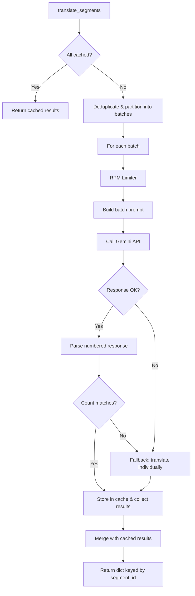

# Design Document: Gemini Batch Translation

## Overview

This feature modifies the existing `GeminiTranslator` class to support batch translation — sending up to N texts (default 10, configurable up to 20) in a single Gemini API call instead of one text per call. The design adds a batch prompt template using numbered lists, a response parser that splits numbered-list responses back into individual translations, and a fallback mechanism that retries failed items individually.

The batch approach reduces API calls by up to 10x for typical video translation workloads, improving throughput and reducing the risk of hitting the free-tier RPM quota. The existing single-text `translate()` method remains unchanged for backward compatibility.

## Architecture



The batch translation logic is contained entirely within the existing `GeminiTranslator` class. No new classes are introduced — the batch assembly, prompt construction, response parsing, and fallback logic are implemented as private methods on the existing class.

### Key Design Decisions

1. **No new class hierarchy** — Batch logic lives as private methods on `GeminiTranslator`. This keeps the public API surface unchanged and avoids over-engineering for what is fundamentally an internal optimization.

2. **Numbered-list protocol** — The batch prompt uses a numbered list format (`1. text`, `2. text`, ...) for both input and expected output. This is the most reliable format for LLM structured output without requiring JSON mode.

3. **Fail-fast to individual fallback** — If the batch response cannot be parsed (count mismatch, exception), the entire batch falls back to individual `translate()` calls. This prioritizes correctness over performance.

4. **Cache deduplication before batching** — Duplicate normalized texts within a batch are sent only once to the API. All segments sharing the same normalized text receive the same `Translation_Result`.

5. **RPM counted per batch call, not per text** — Each batch API call counts as one request against the RPM limiter, matching how the Gemini API actually counts requests.

## Components and Interfaces

### Modified: `GeminiTranslator`

The existing class gains the following private methods:

| Method | Signature | Purpose |
|--------|-----------|---------|
| `_translate_batch` | `(texts: list[str]) -> list[Translation_Result]` | Orchestrates one batch: prompt → call → parse → fallback |
| `_build_batch_prompt` | `(texts: list[str]) -> str` | Constructs the numbered-list batch prompt |
| `_parse_batch_response` | `(response: str, expected_count: int) -> list[str] \| None` | Parses numbered response; returns `None` on count mismatch |

The public `translate_segments` method is rewritten to use batch logic internally.

### Modified: `Gemini_Config`

A new field `batch_size: int = 10` is added with validation `[1, 20]`.

### Unchanged

- `translate(text: str) -> Translation_Result` — public API unchanged
- `_call_backend(text: str) -> str` — still used for individual fallback calls
- `_respect_rpm()` — called once per batch API call
- `_build_prompt(source: str) -> str` — still used for single-text calls

## Data Models

### `Gemini_Config` (modified)

```python
@dataclass(frozen=True, slots=True)
class Gemini_Config:
    enabled: bool = False
    model: str = "gemini-2.5-flash-lite"
    api_key_env: str = "GEMINI_API_KEY"
    max_chars_target: int = 0
    rpm: int = 15
    timeout_seconds: float = 30.0
    batch_size: int = 10  # NEW: [1, 20]

    def __post_init__(self) -> None:
        # ... existing validations ...
        if not (1 <= self.batch_size <= 20):
            raise ValueError(
                f"translator.gemini.batch_size must be in [1, 20] "
                f"(got {self.batch_size})"
            )
```

### Batch Prompt Template

```python
_BATCH_PROMPT_TEMPLATE = (
    "Bạn là biên dịch viên Hán-Việt. Dịch các chuỗi tiếng Trung dưới đây sang "
    "tiếng Việt theo các quy tắc sau:\n"
    "1. Trả về DUY NHẤT bản dịch tiếng Việt cho mỗi dòng, không thêm chú thích.\n"
    "2. Giữ giọng văn tự nhiên, phù hợp ngữ cảnh phụ đề video hài.\n"
    "3. Mỗi bản dịch trên một dòng riêng, đánh số theo thứ tự (1. bản dịch, 2. bản dịch, ...).\n"
    "4. Không thêm dấu nháy, không thêm chú thích, không thêm dòng trống.\n"
    "{length_constraint}"
    "Các câu gốc:\n{numbered_sources}"
)
```

### Internal Data Flow

```
Input: segments = [seg_A, seg_B, seg_C, seg_D, seg_A_dup]
                                                    ↓
Step 1 - Cache lookup:     seg_A (cached) → result_A
                           seg_B, seg_C, seg_D → need translation
                           seg_A_dup (same text as seg_A) → result_A from cache
                                                    ↓
Step 2 - Deduplicate:      unique texts = [text_B, text_C, text_D]
                                                    ↓
Step 3 - Partition:         batch_1 = [text_B, text_C, text_D]  (< batch_size)
                                                    ↓
Step 4 - Translate batch:   API call → "1. dịch_B\n2. dịch_C\n3. dịch_D"
                                                    ↓
Step 5 - Parse & cache:     cache[text_B] = result_B, etc.
                                                    ↓
Step 6 - Assemble output:   {seg_A.id: result_A, seg_B.id: result_B, 
                             seg_C.id: result_C, seg_D.id: result_D,
                             seg_A_dup.id: result_A}
```

## Correctness Properties

*A property is a characteristic or behavior that should hold true across all valid executions of a system — essentially, a formal statement about what the system should do. Properties serve as the bridge between human-readable specifications and machine-verifiable correctness guarantees.*

### Property 1: Partitioning preserves order and respects batch_size

*For any* list of N non-cached segments and any valid batch_size B in [1, 20], partitioning the list into batches SHALL produce ceil(N/B) batches where each batch has at most B items, no batch is empty, and concatenating all batches in order yields the original sequence.

**Validates: Requirements 1.1, 1.2, 1.4, 8.5**

### Property 2: All-cached input produces zero API calls

*For any* sequence of segments where every segment's normalized text exists in the cache with status "translated" or "passthrough", calling translate_segments SHALL return results for all segments without invoking any Gemini API call.

**Validates: Requirements 1.3**

### Property 3: Output completeness

*For any* non-empty sequence of segments (with any mix of cached/non-cached/duplicate texts), translate_segments SHALL return a dictionary with exactly len(segments) entries, one per input segment_id, each containing a valid Translation_Result.

**Validates: Requirements 1.6, 5.4, 7.3**

### Property 4: Batch prompt/parse round-trip

*For any* list of 1 to 20 non-empty strings (containing no newlines), formatting them as a numbered list using the batch prompt format and then parsing that numbered list back SHALL yield the original strings in the same order.

**Validates: Requirements 2.1, 2.2, 3.1, 3.2**

### Property 5: Length constraint conditional inclusion

*For any* max_chars_target value, the batch prompt SHALL contain the character-limit instruction if and only if max_chars_target > 0.

**Validates: Requirements 2.3**

### Property 6: Parser robustness against whitespace, quotes, and empty lines

*For any* list of translation strings, a numbered-list response with arbitrary leading/trailing whitespace on each line, optional surrounding quotes on each translation, and random empty lines interspersed SHALL parse to the same cleaned translations as a minimal well-formatted response.

**Validates: Requirements 3.4, 3.5, 3.6**

### Property 7: Count mismatch detection

*For any* expected count N and any response containing a number of numbered lines M where M ≠ N, the parser SHALL return None (signaling failure) rather than a list of translations.

**Validates: Requirements 3.3**

### Property 8: Batch failure triggers individual fallback

*For any* batch of texts where the batch API call raises an exception or the response has a count mismatch, the system SHALL fall back to calling the single-text translate method for each text in that batch, and the final results SHALL contain one Translation_Result per text.

**Validates: Requirements 4.1, 4.2**

### Property 9: Empty parsed items trigger per-item retry

*For any* batch response where K out of N parsed translations are empty (after stripping), exactly those K items SHALL be retried via the single-text translate method, while the remaining N-K items SHALL retain their batch-parsed translations.

**Validates: Requirements 4.3**

### Property 10: Cache filtering policy

*For any* segment whose normalized text exists in the cache, the segment SHALL be excluded from batch assembly if and only if the cached status is "translated" or "passthrough". Segments with cached status "untranslated" SHALL be included in the batch for re-translation.

**Validates: Requirements 5.1, 5.2**

### Property 11: Successful translation populates cache

*For any* batch of texts that translates successfully, every resulting Translation_Result SHALL be stored in the cache keyed by normalized source text, such that a subsequent call with the same text returns the cached result without an API call.

**Validates: Requirements 5.3**

### Property 12: Deduplication within batches

*For any* set of segments where K segments share the same normalized source text, the batch API call SHALL contain that text at most once, and all K segments SHALL receive the same Translation_Result in the output.

**Validates: Requirements 5.5**

### Property 13: RPM limiter called once per batch

*For any* batch of N texts (where N ≥ 1), the RPM limiter SHALL be invoked exactly once for the batch API call, regardless of N.

**Validates: Requirements 6.1**

### Property 14: batch_size validation

*For any* integer value V, constructing Gemini_Config with batch_size=V SHALL succeed if and only if 1 ≤ V ≤ 20. Values outside this range SHALL raise a ValueError.

**Validates: Requirements 8.3, 8.4**

## Error Handling

| Scenario | Behavior | Recovery |
|----------|----------|----------|
| Batch API call raises exception | Log warning with batch index, count, reason | Fall back to individual `translate()` for each text in the batch |
| Response count mismatch | Log warning with expected vs actual count | Fall back to individual `translate()` for each text in the batch |
| Individual item in parsed response is empty | Log debug message | Retry that specific item via single-text `translate()` |
| Individual fallback also fails | Log error | Record as `Translation_Result(status="untranslated", error_message=...)` |
| RPM limit reached | Block until window permits | Automatic via existing `_respect_rpm()` mechanism |
| Empty/whitespace-only source text | Return passthrough immediately | No API call needed |
| `batch_size` out of range [1, 20] | Raise `ValueError` in `__post_init__` | Fail fast at config load time |

### Logging Strategy

- **WARNING**: Batch fallback triggered (includes batch index, text count, reason)
- **DEBUG**: RPM throttling, cache hits, batch sizes
- **ERROR**: All retries exhausted for a text (both batch and individual)

## Testing Strategy

### Property-Based Tests (Hypothesis)

The project already includes `hypothesis==6.152.9`. Each correctness property above maps to one property-based test with a minimum of 100 iterations.

**Library**: `hypothesis` (already in requirements.txt)
**Location**: `tests/property/test_batch_translation_properties.py`
**Configuration**: Each test uses `@settings(max_examples=100)` minimum.

Each test is tagged with a comment:
```python
# Feature: gemini-batch-translation, Property 1: Partitioning preserves order and respects batch_size
```

**Key generators needed:**
- `st_segment()` — generates valid `Text_Segment` objects with random canonical_text
- `st_batch_size()` — integers in [1, 20]
- `st_translation_text()` — non-empty strings without newlines (for round-trip tests)
- `st_numbered_response()` — well-formed numbered-list strings with optional noise (whitespace, quotes, empty lines)

### Unit Tests (pytest)

**Location**: `tests/unit/test_batch_translation.py`

Focus areas:
- Specific examples demonstrating correct batch assembly
- Edge cases: empty input, batch_size=1, batch_size=20, single segment
- Fallback logging verification (captured log assertions)
- Config validation boundary values (0, 1, 20, 21)
- Integration between cache and batch assembly

### Integration Tests

**Location**: `tests/integration/test_gemini_batch_integration.py`

- End-to-end test with mocked Gemini API returning numbered-list responses
- RPM limiter interaction with multiple sequential batches
- Mixed cache states across multiple `translate_segments` calls

### Test Isolation

All tests mock the Gemini API client (`self._client.models.generate_content`). No real API calls are made in automated tests. The `_call_backend` method is the seam for mocking single-text calls; a new `_call_batch_backend` (or direct mock of `generate_content`) is the seam for batch calls.

