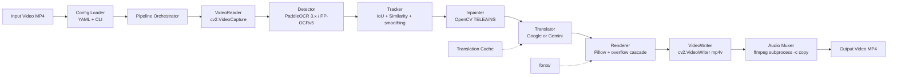
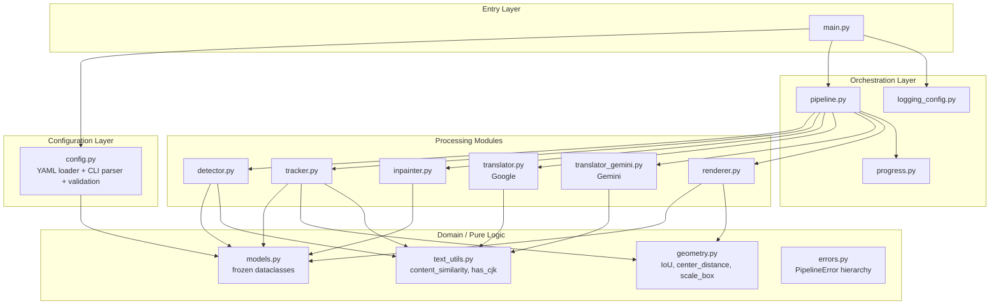
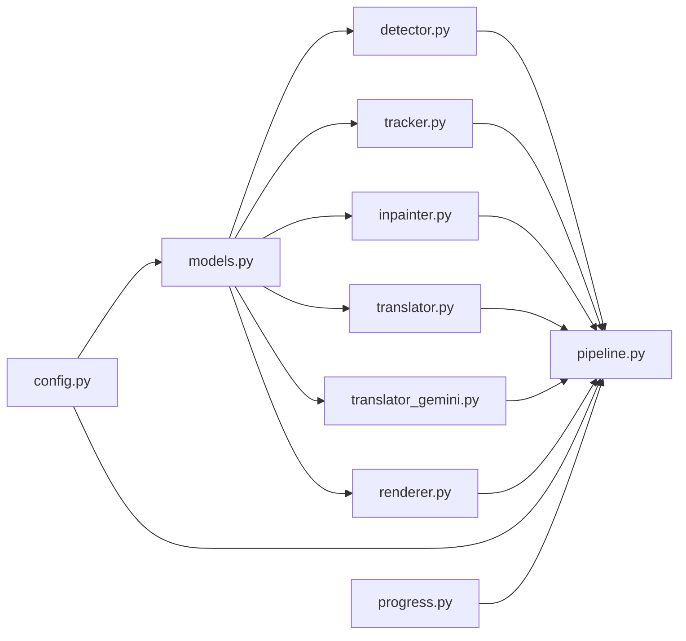

# Design Document

## Overview

Video Text Translator là một pipeline Python xử lý video tiếng Trung sang tiếng Việt theo mô hình streaming, end-to-end. Thiết kế tổ chức quanh 6 module độc lập (Detector, Tracker, Inpainter, Translator, Renderer, Pipeline) được kết nối qua dependency injection trong một orchestrator duy nhất. Mỗi module có interface rõ ràng và có thể test riêng biệt, với phần lõi thuật toán (IoU, content similarity, auto-fit, mask generation) được tách thành pure functions để dễ kiểm chứng bằng property-based testing.

Hệ thống ưu tiên 3 đặc tính:
- **Streaming**: Frame được đọc, xử lý và ghi theo từng frame trong generator-style loop (chỉ giữ 1 frame "live" + tqdm buffer) thay vì nạp toàn bộ vào RAM.
- **Cấu hình hai tầng**: YAML config làm default, CLI argument override từng giá trị, cho phép vận hành tự động (CI) lẫn thử nghiệm nhanh.
- **Khả năng nâng cấp module**: Mỗi module có interface (`Protocol`) cho phép thay thế (ví dụ thay OpenCV inpaint bằng ProPainter, thay Google Translate bằng Gemini hoặc NLLB-200) mà không phá vỡ pipeline. Hai backend dịch (`GoogleTranslator`, `GeminiTranslator`) đã được hiện thực sẵn theo cùng một protocol.

### Quyết định thiết kế chính

| Quyết định | Lý do |
|---|---|
| Bundle font Việt mặc định trong `fonts/` (Noto Sans Regular + Condensed, Be Vietnam Pro) | Đảm bảo tool chạy được ngay; bản Condensed dùng làm fallback khi text Việt dài hơn box gốc |
| YAML config + CLI override | Tách cấu hình mặc định khỏi tham số runtime, dễ chia sẻ preset |
| Pure functions cho IoU/content_similarity/auto-fit/mask | Cho phép kiểm thử bằng PBT mà không cần mock |
| Frozen dataclass cho data models | Bất biến, an toàn khi truyền qua nhiều module; validation chạy trong `__post_init__` để giá trị sai không bao giờ tồn tại runtime |
| Streaming reader/writer qua OpenCV `VideoCapture`/`VideoWriter`, mux audio bằng `ffmpeg` subprocess (`-c copy`) | Giữ RAM thấp, ghép audio không re-encode |
| OCR_Stride + OCR_Downscale như tham số tăng tốc | Cân bằng speed/accuracy, đặc biệt cho CPU |
| Compute_Mode tự fallback gpu→cpu khi không có GPU | Hoạt động trên cả máy có và không có GPU; fallback xảy ra trong `PaddleOCRDetector.__init__` |
| Pluggable translator backend (Google deep-translator vs Gemini) | Free quota của Google rate-limit nặng, Gemini 2.5 Flash-Lite cho kết quả ổn định hơn cho phụ đề; cùng một `ITranslator` protocol nên Pipeline không cần biết khác nhau |
| Smooth box bằng moving-average sau khi tracker finalize | OCR jitter ±1-2 px gây "wobble" rõ rệt với phụ đề; smoothing giảm rung mà không xoá motion thật |
| Pre-compute một font size cố định cho mỗi segment (dùng box nhỏ nhất) | Nếu auto-fit lại mỗi frame, kích thước chữ thay đổi theo OCR jitter và mắt thấy chữ nhấp nhô; cố định giúp text ổn định |
| Overflow cascade: expand bbox → word-wrap → condensed font | Bản dịch tiếng Việt thường dài hơn câu Trung gốc; cascade cho phép vẫn render đầy đủ thay vì bỏ qua frame |

## Architecture

### High-level Pipeline



### Layered View



### Module Dependencies



Hai luật quan trọng:
1. `models.py` không import bất kỳ module nào khác trong package (no circular).
2. Các module xử lý (Detector/Tracker/Inpainter/Translator/Renderer) không import lẫn nhau, chỉ import `models.py`, `errors.py` và pure helpers (`geometry.py`, `text_utils.py`). Pipeline là nơi duy nhất ghép chúng lại; `main.py` là nơi duy nhất chọn backend translator cụ thể.

## Components and Interfaces

Tất cả các module dưới đây được thiết kế để inject vào `Pipeline` qua constructor, cho phép thay thế bằng mock/fake khi test.

### 1. Detector (`detector.py`)

```python
from typing import Protocol, Sequence
import numpy as np
from .models import Text_Region

class IDetector(Protocol):
    def detect(
        self, frame: np.ndarray, frame_index: int, timestamp: float
    ) -> Sequence[Text_Region]: ...
    def detect_batch(
        self,
        frames: Sequence[np.ndarray],
        frame_indices: Sequence[int],
        timestamps: Sequence[float],
    ) -> Sequence[Sequence[Text_Region]]: ...
    def warmup(self) -> None: ...

class PaddleOCRDetector:
    def __init__(
        self,
        compute_mode: str = "cpu",       # "cpu" | "gpu"
        confidence_threshold: float = 0.5,
        downscale: float = 1.5,
        lang: str = "ch",
        model_variant: str = "mobile",   # "mobile" (PP-OCRv5_mobile) | "server"
        cpu_threads: int = 0,            # 0 = use all logical cores
    ) -> None: ...

    def detect(
        self, frame: np.ndarray, frame_index: int, timestamp: float
    ) -> list[Text_Region]:
        """Run OCR on a single frame.

        Pipeline:
          1. If downscale > 1.0: resize frame bilinear to (W/s, H/s)
          2. Call PaddleOCR.predict(small)
          3. Read result["rec_texts"], ["rec_scores"], ["rec_polys"]
          4. Filter by confidence_threshold
          5. Filter to keep only strings containing at least one CJK char
          6. Convert each 4-vertex polygon to an axis-aligned Bounding_Box
             and scale back to original-frame coordinates (clip to frame)
          7. Return list[Text_Region]
        """

    def detect_batch(
        self,
        frames: Sequence[np.ndarray],
        frame_indices: Sequence[int],
        timestamps: Sequence[float],
    ) -> list[list[Text_Region]]:
        """Loop ``detect`` over the batch. PaddleOCR 3.x' predict() does the
        internal det+rec batching itself, so we keep this method as a simple
        wrapper for symmetry with the protocol."""
```

Hành vi quan trọng:
- Backbone: PaddleOCR 3.x với `text_detection_model_name = "PP-OCRv5_<variant>_det"` và `text_recognition_model_name = "PP-OCRv5_<variant>_rec"`. `mobile` là mặc định (nhanh), `server` chính xác hơn nhưng chậm hơn 5–10× trên CPU.
- Doc-orientation classify, doc unwarping và textline orientation đều bị tắt vì input là phụ đề video chứ không phải document scan.
- `enable_mkldnn=False`: PaddlePaddle 3.x trên Windows hiện có nhánh codegen oneDNN chưa hoàn chỉnh (`ConvertPirAttribute2RuntimeAttribute not support ...`) gây lỗi mỗi frame; tắt MKLDNN dùng kernel thuần CPU/GPU vẫn ổn định.
- Filter CJK qua `text_utils.has_cjk` (Req 2.3): `0x4E00..0x9FFF` hoặc `0x3400..0x4DBF`.
- Mọi exception từ PaddleOCR ở cấp single-frame: log + trả `[]` (Req 2.7).
- Compute_Mode fallback gpu→cpu được xử lý trong `__init__` (try `device="gpu"`, nếu fail và đang ở mode gpu thì retry với `device="cpu"` và set `effective_compute_mode = "cpu"`); fail cả CPU sẽ raise `ComputeInitError` (Req 7.4, 7.5).

### 2. Tracker (`tracker.py`)

```python
from typing import Protocol
from .models import Text_Region, Text_Segment

class ITracker(Protocol):
    def update(
        self, frame_index: int, timestamp: float, regions: Sequence[Text_Region]
    ) -> None: ...
    def finalize(self) -> tuple[Text_Segment, ...]: ...

class IoUContentTracker:
    def __init__(
        self,
        frame_width: int,
        frame_height: int,
        iou_threshold: float = 0.5,
        content_similarity_threshold: float = 0.7,
        center_distance_ratio: float = 0.10,   # fraction of frame diagonal
        n_inactive: int = 3,                   # raw config, will be combined with stride
        ocr_stride: int = 1,
        max_active_segments: int = 100,
    ) -> None: ...

    def update(
        self, frame_index: int, timestamp: float, regions: Sequence[Text_Region]
    ) -> None:
        """Pre-filter empty regions (Req 3.8); score every (region, active
        segment) pair that satisfies IoU>=iou_threshold OR
        (similarity>=sim_threshold AND center_distance<=ratio*diagonal);
        greedy resolve highest-score matches; spawn new segments for
        unmatched regions; close segments inactive for >
        n_inactive_effective frames; enforce max_active_segments."""

    def finalize(self) -> tuple[Text_Segment, ...]:
        """Close all remaining active segments, run _fill_missing
        (linear interpolation between observed entries) and
        _smooth_boxes (centered moving-average), and return immutable
        Text_Segment tuples."""
```

Hành vi quan trọng:
- `n_inactive_effective = max(3, ceil(n_inactive * ocr_stride))` (Req 10.9). Property `n_inactive_effective` trên instance phơi giá trị tính ra cho test/log.
- Khi nhiều region cùng matching một segment trong cùng frame, greedy resolve theo điểm `score = iou + similarity - center_dist/diagonal` (cao thắng).
- Canonical text của segment được cập nhật theo nguyên tắc "ưu tiên chuỗi dài hơn" (`_pick_canonical`). Lý do: hiệu ứng phóng to thường lộ thêm glyph theo thời gian, chuỗi dài hơn thường đầy đủ hơn.
- `_fill_missing` dùng **linear interpolation** giữa hai frame quan sát kế cận (không phải nearest-neighbour), để box chuyển động mượt thay vì giật mỗi `ocr_stride` frame. Text của các frame nội suy chọn theo chuỗi dài hơn giữa hai mỏ neo.
- `_smooth_boxes` chạy moving-average (window mặc định 5) trên các box đã sắp xếp theo `frame_index` để khử OCR jitter ±1-2 px. Văn bản và `frame_index/timestamp` không bị ảnh hưởng.
- Segment đã đóng không bao giờ được mở lại; nếu nội dung tương tự xuất hiện sau đó, segment mới được spawn (Req 3.7).

### 3. Inpainter (`inpainter.py`)

```python
from typing import Protocol
import numpy as np
from .models import Bounding_Box

class IInpainter(Protocol):
    def inpaint_frame(
        self, frame: np.ndarray, boxes: Sequence[Bounding_Box]
    ) -> np.ndarray: ...

# Module-level pure function used by the implementation and PBT.
def make_mask(
    frame_shape: tuple[int, int],   # (height, width)
    boxes: Sequence[Bounding_Box],
    padding: int = 4,
) -> np.ndarray: ...

class OpenCVInpainter:
    def __init__(
        self,
        algorithm: str = "telea",   # "telea" | "ns" (validated, raises InvalidConfigError)
        radius: int = 3,            # 1..20
        padding: int = 4,           # 0..20
    ) -> None: ...

    def inpaint_frame(
        self, frame: np.ndarray, boxes: Sequence[Bounding_Box]
    ) -> np.ndarray:
        """Build a binary uint8 mask covering all (padded, clipped) boxes
        and apply ``cv2.inpaint`` with the chosen algorithm. If ``boxes``
        is empty the original frame is returned unchanged. On unexpected
        failure the error is logged and the original frame is returned."""
```

Cờ thuật toán map: `"telea" -> cv2.INPAINT_TELEA`, `"ns" -> cv2.INPAINT_NS`. Validation cho giá trị khác xảy ra cả ở `Inpainter_Config.__post_init__` (lúc load config) và trong `OpenCVInpainter.__init__` (defense-in-depth, raise `InvalidConfigError`). `make_mask` là module-level function (không phải instance method) nên dễ test PBT độc lập.

### 4. Translator (`translator.py`, `translator_gemini.py`)

Hai backend cùng implement protocol `ITranslator`. Pipeline chỉ phụ thuộc vào protocol nên có thể swap qua config (`translator.backend = "google" | "gemini"`).

```python
from typing import Protocol
from .models import Text_Segment, Translation_Result, Gemini_Config

class ITranslator(Protocol):
    def translate(self, text: str) -> Translation_Result: ...
    def translate_segments(
        self, segments: Sequence[Text_Segment]
    ) -> dict[str, Translation_Result]: ...

class GoogleTranslator:
    """deep-translator (free Google Translate web endpoint) wrapper."""
    def __init__(
        self,
        timeout_seconds: float = 10.0,
        max_chars: int = 5000,
        max_retries: int = 3,
        backoff_seconds: tuple[float, ...] = (1.0, 2.0, 4.0),
        source_lang: str = "zh-CN",
        target_lang: str = "vi",
        sleep: Callable[[float], None] = time.sleep,
    ) -> None: ...

    def translate(self, text: str) -> Translation_Result:
        """Cache-aware translate.
        - Empty/whitespace-only -> return as-is, status="passthrough"
        - len(text.strip()) > max_chars -> return original, status="untranslated", warn
        - Otherwise: try backend, retry up to max_retries with backoff
          (sleep between attempts only, not after the final one)
        - On final failure: return original, status="untranslated", error
        - On success: cache by stripped text (case-sensitive)
        """

class GeminiTranslator:
    """Gemini 2.5 Flash-Lite wrapper using the official google-genai SDK.

    Reads the API key from the env var named by ``Gemini_Config.api_key_env``
    (default: GEMINI_API_KEY) and raises ``InvalidConfigError`` if it is
    empty. Soft RPM limiter prevents 429s from the free-tier quota.
    """
    def __init__(
        self,
        config: Gemini_Config,
        max_retries: int = 3,
        backoff_seconds: tuple[float, ...] = (1.0, 2.0, 4.0),
    ) -> None: ...

    def translate(self, text: str) -> Translation_Result:
        """Same passthrough/cache contract as GoogleTranslator. Backend
        invocation respects ``rpm`` (drops calls older than 60 s, sleeps
        if the rolling window is full) and uses a fixed Hán-Việt subtitle
        prompt (low temperature, max_output_tokens=512). Surrounding
        quotes that the model occasionally adds are stripped before
        returning."""
```

Behaviour summary:
- Cache key trong cả hai backend là chuỗi đã `strip()` (Req 5.3): hai segment có nội dung giống nhau (sau khi loại whitespace đầu/cuối) chỉ gọi backend một lần.
- Whitespace-only → `status="passthrough"`, không gọi backend (Req 5.6).
- Quá `max_chars` (chỉ áp dụng với `GoogleTranslator`) → `status="untranslated"`, không gọi backend (Req 5.7).
- Sau `max_retries + 1` lần thất bại liên tiếp với exponential backoff `(1, 2, 4)` giây → `status="untranslated"`, `error_message` là `"<ExceptionType>: <message>"` (Req 5.4, 5.5).

### 5. Renderer (`renderer.py`)

```python
from typing import Protocol
import numpy as np
from .models import Bounding_Box, Style_Preset

class IRenderer(Protocol):
    def render(
        self,
        frame: np.ndarray,
        text_vi: str,
        box: Bounding_Box,
        style: Style_Preset,
        *,
        segment_id: str | None = None,
        frame_index: int | None = None,
        fixed_font_size: int | None = None,    # set by Pipeline for stability
        frame_size: tuple[int, int] | None = None,  # (width, height)
    ) -> np.ndarray: ...

class PillowRenderer:
    def __init__(self, default_font_path: str) -> None: ...

    def auto_fit_font_size(
        self,
        text: str,
        box: Bounding_Box,
        style: Style_Preset,
        *,
        font_path: str | None = None,
    ) -> int | None:
        """Single-line, integer-binary-search auto-fit in [min, max].
        Returns the largest size that fits, or None if even at min the
        rendered rectangle (including stroke + shadow offset) exceeds
        the box."""

    @staticmethod
    def place_text(
        text_size: tuple[int, int], box: Bounding_Box,
    ) -> tuple[int, int] | None:
        """Top-left position with <=2 px tolerance from box center, or
        None when no such position exists (Req 6.5, 6.6)."""

    def render(self, frame, text_vi, box, style, **kwargs) -> np.ndarray:
        """Plan layout via the overflow cascade (see below) and draw
        background -> shadow -> stroked text on a Pillow RGBA overlay
        composited back onto the frame. If no plan fits, the frame is
        returned unchanged and a warning is logged with segment_id +
        frame_index (Req 6.7)."""
```

#### Overflow cascade (`Overflow_Config`)

Bản dịch tiếng Việt thường dài hơn câu Trung gốc nên auto-fit trên box gốc thường thất bại. Renderer thử các plan theo thứ tự, lấy plan đầu tiên fit:

0. Box gốc, một dòng, font Regular.
1. Box mở rộng (`expand_bbox_max`× quanh tâm, clip vào frame), một dòng, font Regular.
2. Box gốc, word-wrap (2..`word_wrap_max_lines` dòng), font Regular.
3. Box mở rộng, word-wrap, font Regular.
4. Lặp lại 0..3 với font Condensed (`overflow.condensed_font_path`, mặc định `fonts/NotoSans-Condensed.ttf`).

Mỗi plan auto-fit kích thước font qua binary search để tối đa hóa `font_size` mà vẫn fit. Word-wrap dùng greedy near-balanced split trên whitespace (chỉ tách được khi đủ token).

#### Pre-computed font size per segment

Pipeline gọi `auto_fit_font_size(text_vi, smallest_box_in_segment, style)` một lần cho mỗi segment trước Pass 2 và truyền kết quả vào tham số `fixed_font_size`. Lý do: nếu auto-fit lại mỗi frame, OCR jitter ±1-2 px khiến font size dao động và mắt thấy chữ "thở". Khi `fixed_font_size` truyền vào, `_auto_fit` chỉ kiểm tra liệu kích thước cố định đó có fit hay không, không re-search.

Nếu `fixed_font_size` là `None` (không fit nổi ngay cả ở `font_size_min` trên smallest box), renderer rơi xuống full overflow cascade per frame để vẫn cố gắng render.

### 6. Pipeline (`pipeline.py`)

```python
class Pipeline:
    def __init__(
        self,
        config: Config,
        detector: IDetector,
        tracker: ITracker,
        inpainter: IInpainter,
        translator: ITranslator,
        renderer: IRenderer,
        progress: ProgressReporter | None = None,
    ) -> None: ...

    def run(self) -> int:
        """Returns a process exit code:
            0 - success
            2 - pre-flight / input validation error (PipelineError before stage 1)
            3 - PipelineError raised during stages
            4 - unhandled exception (top-level safety net)
            5 - output verification failed (file missing or 0 bytes)

        Stages:
            1. _validate_inputs: paths, readability, size limit, output dir writable
            2. _open_video:      cv2.VideoCapture + sanity-check metadata + duration limit
            3. _pass1:           streaming, OCR every ocr_stride frames, tracker.update;
                                 tracker.finalize() also runs fill_missing + smoothing
            4. (no-text fallback): if 0 segments, copy input to output and verify
            5. _translate_segments: one call per unique segment via the configured backend
            6. _pass2:           streaming, inpaint + render + write to <output>.tmp.mp4;
                                 per-segment fixed_font_size pre-computed using smallest box
            7. _mux_audio:       ffmpeg -c copy mux of tmp video + original audio (or
                                 rename tmp -> output when input has no audio)
            8. _verify_output:   confirm output exists and is non-empty; print abs path
        """
```

Notes that differ from a textbook 2-pass pipeline:
- The tracker performs `fill_missing` (linear interpolation) and box smoothing inside `finalize()`, so the orchestrator never calls them explicitly.
- Pre-flight checks raise `InvalidInputError` (subclass of `PipelineError`) and produce exit code 2; downstream stage failures map to 3, 4 or 5.
- Audio detection uses `ffprobe` (subprocess) to test for a non-empty audio stream; if `ffprobe` is missing the pipeline assumes no audio and falls through to the rename-tmp path.
- `_tmp_video_path()` returns `<output>.tmp.mp4`. After successful mux the tmp file is deleted; failures during mux raise `OutputWriteError`.
- `Pipeline.run()` does not take parameters; `input_path` and `output_path` are read from the immutable `Config`.

Pipeline chạy 2-pass:
- **Pass 1**: phát hiện + theo dõi để có đầy đủ segments với boxes/text per frame.
- **Pass 2**: render output video (cần biết segment trải dài thế nào trước khi inpaint+render).
- Giữa 2 pass: dịch một lần cho toàn bộ segments (cache theo text); pre-compute `fixed_font_size` cho mỗi segment.

Lý do 2-pass thay vì 1-pass: `n_inactive` đòi hỏi chờ vài frame sau để xác định segment đóng; render đòi hỏi biết toàn bộ segment để pre-compute font size ổn định và để dịch một lần (rẻ hơn, ổn định hơn).

## Data Models

Tất cả data models dùng `@dataclass(frozen=True, slots=True)` (Python 3.12). Validation thực hiện trong `__post_init__` cho các invariant đơn giản, đảm bảo không bao giờ tồn tại instance không hợp lệ ở runtime.

```python
# models.py

from dataclasses import dataclass, field
from typing import Literal

@dataclass(frozen=True, slots=True)
class Bounding_Box:
    x: int           # >= 0, in pixel
    y: int           # >= 0, in pixel
    width: int       # > 0
    height: int      # > 0

    def __post_init__(self):
        if self.width <= 0 or self.height <= 0:
            raise ValueError("Bounding_Box dimensions must be positive")
        if self.x < 0 or self.y < 0:
            raise ValueError("Bounding_Box origin must be non-negative")

    @property
    def x2(self) -> int: return self.x + self.width
    @property
    def y2(self) -> int: return self.y + self.height
    @property
    def center(self) -> tuple[float, float]:
        return (self.x + self.width / 2, self.y + self.height / 2)
    @property
    def area(self) -> int: return self.width * self.height

@dataclass(frozen=True, slots=True)
class Text_Region:
    box: Bounding_Box
    text: str
    confidence: float        # in [0.0, 1.0]
    frame_index: int         # >= 0
    timestamp: float         # seconds, >= 0

@dataclass(frozen=True, slots=True)
class Frame_Region_Entry:
    frame_index: int
    timestamp: float
    box: Bounding_Box
    text: str                # OCR text at this frame (may be interpolated)
    interpolated: bool = False  # True if filled by Tracker.fill_missing

@dataclass(frozen=True, slots=True)
class Text_Segment:
    segment_id: str               # e.g. "seg-000007"
    start_frame: int
    end_frame: int
    start_time: float
    end_time: float
    canonical_text: str           # representative source text (longest seen)
    entries: tuple[Frame_Region_Entry, ...]   # one per frame in [start_frame, end_frame]

Translation_Status = Literal["translated", "passthrough", "untranslated"]

@dataclass(frozen=True, slots=True)
class Translation_Result:
    source_text: str
    translated_text: str
    status: Translation_Status
    error_message: str | None = None

@dataclass(frozen=True, slots=True)
class Overflow_Config:
    expand_bbox_enabled: bool = True
    expand_bbox_max: float = 1.5            # in [1.0, 4.0]
    word_wrap_enabled: bool = True
    word_wrap_max_lines: int = 3            # in [1, 10]
    condensed_enabled: bool = True
    condensed_font_path: str = "fonts/NotoSans-Condensed.ttf"

@dataclass(frozen=True, slots=True)
class Style_Preset:
    font_path: str
    font_size_max: int = 64                 # in [8, 512]
    font_size_min: int = 12                 # in [6, font_size_max]
    text_rgb: tuple[int, int, int] = (255, 255, 255)
    stroke_enabled: bool = True
    stroke_rgb: tuple[int, int, int] = (0, 0, 0)
    stroke_width: int = 2                   # in [0, 20]
    background_enabled: bool = True
    background_rgb: tuple[int, int, int] = (0, 0, 0)
    background_alpha: int = 128             # in [0, 255]
    shadow_enabled: bool = True
    shadow_rgb: tuple[int, int, int] = (0, 0, 0)
    shadow_offset: tuple[int, int] = (2, 2) # each in [-50, 50]
    overflow: Overflow_Config | None = None

@dataclass(frozen=True, slots=True)
class Detector_Config:
    confidence_threshold: float = 0.5       # in [0.0, 1.0]
    batch_size: int = 4                     # in [1, 32]
    model_variant: Literal["mobile", "server"] = "mobile"
    cpu_threads: int = 0                    # 0 = auto (all logical cores), max 64

@dataclass(frozen=True, slots=True)
class Tracker_Config:
    iou_threshold: float = 0.5
    content_similarity_threshold: float = 0.7
    center_distance_ratio: float = 0.10     # in (0.0, 1.0]
    n_inactive: int = 3                     # in [1, 30]
    max_active_segments: int = 100          # in [1, 1000]

@dataclass(frozen=True, slots=True)
class Inpainter_Config:
    algorithm: Literal["telea", "ns"] = "telea"
    radius: int = 3                         # in [1, 20]
    padding: int = 4                        # in [0, 20]

@dataclass(frozen=True, slots=True)
class Gemini_Config:
    enabled: bool = False                   # legacy switch (use translator.backend)
    model: str = "gemini-2.5-flash-lite"
    api_key_env: str = "GEMINI_API_KEY"
    max_chars_target: int = 0               # 0 = no length cap
    rpm: int = 15                           # in [1, 1000]
    timeout_seconds: float = 30.0           # in (0, 120]

@dataclass(frozen=True, slots=True)
class Translator_Config:
    backend: Literal["google", "gemini"] = "google"
    timeout_seconds: float = 10.0           # in (0, 60]
    max_chars: int = 5000                   # in [1, 10000]
    max_retries: int = 3                    # in [0, 10]
    gemini: Gemini_Config = field(default_factory=Gemini_Config)

@dataclass(frozen=True, slots=True)
class Performance_Config:
    ocr_stride: int = 3                     # in [1, 10]
    ocr_downscale: float = 1.5              # in [1.0, 4.0]
    io_buffer_frames: int = 8               # in [0, 64]
    max_duration_seconds: int = 7200        # > 0
    max_file_size_bytes: int = 5 * 1024 ** 3  # > 0

@dataclass(frozen=True, slots=True)
class Config:
    input_path: str
    output_path: str
    compute_mode: Literal["cpu", "gpu"] = "cpu"
    detector: Detector_Config = field(default_factory=Detector_Config)
    tracker: Tracker_Config = field(default_factory=Tracker_Config)
    inpainter: Inpainter_Config = field(default_factory=Inpainter_Config)
    translator: Translator_Config = field(default_factory=Translator_Config)
    renderer: Style_Preset = field(default_factory=lambda: Style_Preset(font_path=""))
    performance: Performance_Config = field(default_factory=Performance_Config)
```

### Constraint summary

| Field | Range | Default |
|---|---|---|
| `compute_mode` | `cpu` / `gpu` (case-insensitive on input) | `cpu` |
| `detector.confidence_threshold` | [0.0, 1.0] | 0.5 |
| `detector.batch_size` | [1, 32] | 4 |
| `detector.model_variant` | `mobile` / `server` | `mobile` |
| `detector.cpu_threads` | [0, 64] (0 = auto) | 0 |
| `tracker.iou_threshold` | [0.0, 1.0] | 0.5 |
| `tracker.content_similarity_threshold` | [0.0, 1.0] | 0.7 |
| `tracker.center_distance_ratio` | (0.0, 1.0] | 0.10 |
| `tracker.n_inactive` | [1, 30] | 3 |
| `tracker.max_active_segments` | [1, 1000] | 100 |
| `inpainter.algorithm` | `telea` / `ns` | `telea` |
| `inpainter.radius` | [1, 20] | 3 |
| `inpainter.padding` | [0, 20] | 4 |
| `translator.backend` | `google` / `gemini` | `google` (overridden to `gemini` if `gemini.enabled: true`) |
| `translator.timeout_seconds` | (0, 60] | 10.0 |
| `translator.max_chars` | [1, 10000] | 5000 |
| `translator.max_retries` | [0, 10] | 3 |
| `translator.gemini.model` | non-empty | `gemini-2.5-flash-lite` |
| `translator.gemini.rpm` | [1, 1000] | 15 |
| `translator.gemini.timeout_seconds` | (0, 120] | 30.0 |
| `renderer.font_size_max` | [8, 512] | 64 |
| `renderer.font_size_min` | [6, max] | 12 |
| `renderer.stroke_width` | [0, 20] | 2 |
| `renderer.background_alpha` | [0, 255] | 128 |
| `renderer.shadow_offset` | each in [-50, 50] | (2, 2) |
| `renderer.overflow.expand_bbox_max` | [1.0, 4.0] | 1.5 |
| `renderer.overflow.word_wrap_max_lines` | [1, 10] | 3 |
| `performance.ocr_stride` | [1, 10] | 3 |
| `performance.ocr_downscale` | [1.0, 4.0] | 1.5 |
| `performance.io_buffer_frames` | [0, 64] | 8 |

## Algorithms

### A1. IoU (pure function)

```python
def iou(a: Bounding_Box, b: Bounding_Box) -> float:
    inter_x1 = max(a.x, b.x)
    inter_y1 = max(a.y, b.y)
    inter_x2 = min(a.x2, b.x2)
    inter_y2 = min(a.y2, b.y2)
    if inter_x2 <= inter_x1 or inter_y2 <= inter_y1:
        return 0.0
    inter = (inter_x2 - inter_x1) * (inter_y2 - inter_y1)
    union = a.area + b.area - inter
    return inter / union if union > 0 else 0.0
```

Properties (kiểm chứng bằng PBT): `iou(a, a) == 1.0`, `iou(a, b) == iou(b, a)`, `0 <= iou(a, b) <= 1`.

### A2. Content Similarity (pure function)

```python
def content_similarity(a: str, b: str) -> float:
    """Normalized edit distance, returns 1 - levenshtein/max(len(a), len(b))."""
    if not a and not b:
        return 1.0
    if not a or not b:
        return 0.0
    a_norm = a.strip()
    b_norm = b.strip()
    if not a_norm and not b_norm:
        return 1.0
    distance = levenshtein(a_norm, b_norm)
    return 1.0 - distance / max(len(a_norm), len(b_norm))
```

### A3. Tracking algorithm (Tracker.update)

```text
function update(frame_index, timestamp, regions):
    diagonal = sqrt(W² + H²)
    distance_threshold = center_distance_ratio * diagonal

    # 1) Pre-filter: drop empty regions (Req 3.8)
    regions = [r for r in regions if r.text.strip()]

    # 2) Build cost matrix between active segments and new regions
    matches = []
    for r in regions:
        best_seg = None
        best_score = -inf
        for seg in active_segments:
            last = seg.last_entry()
            if frame_index - last.frame_index > n_inactive_effective:
                continue   # too old
            iou_val = iou(last.box, r.box)
            sim = content_similarity(last.text, r.text)
            center_dist = euclidean(last.box.center, r.box.center)
            condition_a = iou_val >= iou_threshold
            condition_b = sim >= sim_threshold and center_dist <= distance_threshold
            if condition_a or condition_b:
                # compose score: prefer higher iou+sim, lower center_dist
                score = iou_val + sim - center_dist / diagonal
                if score > best_score:
                    best_seg, best_score = seg, score
        matches.append((r, best_seg))

    # 3) Greedy resolve conflicts (multiple regions matching same segment)
    used = set()
    for r, seg in sorted(matches, key=lambda m: -score_of(m)):
        if seg is None or seg.id in used:
            new_seg = create_segment(r, frame_index, timestamp)
            register_active(new_seg)
        else:
            seg.append_entry(frame_index, timestamp, r.box, r.text, interpolated=False)
            used.add(seg.id)

    # 4) Close inactive segments
    for seg in active_segments:
        if frame_index - seg.last_entry().frame_index > n_inactive_effective:
            close(seg)

    # 5) Enforce max_active_segments (Req 3.9)
    while len(active_segments) > max_active_segments:
        oldest = min(active_segments, key=lambda s: s.start_frame)
        close(oldest)
```

`n_inactive_effective = max(3, ceil(n_inactive * ocr_stride))` (Req 10.9).

### A4. Frame interpolation (Tracker `_fill_missing`, run inside `finalize`)

Khi `OCR_Stride > 1`, các frame không được OCR sẽ thiếu entry. Sau khi pass 1 đóng segment, ta điền frame còn thiếu bằng **linear interpolation** giữa hai frame quan sát kế cận:

```text
function fill_missing(segment):
    observed = sorted(segment.entries by frame_index)        # observed-only entries
    if observed densely covers [start_frame, end_frame]: return

    for (prev, next) in zip(observed, observed[1:]):
        if next.frame_index - prev.frame_index <= 1: continue
        for f in (prev.frame_index, next.frame_index) exclusive:
            ratio = (f - prev.frame_index) / (next.frame_index - prev.frame_index)
            box = lerp_box(prev.box, next.box, ratio)         # rounded to int, w/h >= 1
            ts  = prev.timestamp + ratio * (next.timestamp - prev.timestamp)
            text = prev.text if len(prev.text) >= len(next.text) else next.text
            insert Frame_Region_Entry(f, ts, box, text, interpolated=True)
```

`lerp_box(a, b, t)` linearly interpolates each of `(x, y, width, height)` and rounds to integers (clamping `width`/`height >= 1`).

For text content of interpolated frames we keep the longer of the two anchor strings — animations often reveal more glyphs over time, so the longer side is usually the more complete sample.

### A4b. Box smoothing (Tracker `_smooth_boxes`, run inside `finalize`)

After fill_missing, OCR jitter (±1-2 px) leaks into the rendered Vietnamese text as visible "wobble". A centered moving-average over a small window (default 5 entries, half-width 2) damps that noise without softening real motion:

```text
function smooth_boxes(segment, window=5):
    if window <= 1 or |segment.entries| < 2: return
    ordered = sorted(segment.entries by frame_index)
    half = window // 2
    for i, entry in enumerate(ordered):
        window_entries = ordered[max(0, i-half) : min(n, i+half+1)]
        new_box = average of (x, y, w, h) over window_entries (rounded, w/h >= 1)
        replace entry.box with new_box (text, frame_index, timestamp unchanged)
```

Smoothing only changes `Bounding_Box` geometry; `frame_index`, `timestamp`, `text`, `interpolated` are preserved.

### A5. Auto-fit font size (Renderer)

Integer binary search per (font, candidate box, line list) combination. The renderer tries plans from the overflow cascade and, for each plan, runs `_auto_fit` to find the largest font size that fits.

```text
function auto_fit(lines, box, style, font_path, fixed_font_size=None):
    # Pipeline pre-computes a stable size per segment using the smallest box;
    # when fixed_font_size is provided we just verify it still fits.
    if fixed_font_size is not None:
        font = get_font(font_path, fixed_font_size)
        return fixed_font_size if fits(block_size(lines, font, style), box) else None

    lo = style.font_size_min
    hi = style.font_size_max
    if not fits(block_size(lines, get_font(font_path, lo), style), box):
        return None  # signals overflow at min size; caller tries next plan

    while lo < hi:
        mid = (lo + hi + 1) // 2
        if fits(block_size(lines, get_font(font_path, mid), style), box):
            lo = mid
        else:
            hi = mid - 1
    return lo

function block_size(lines, font, style):
    line_h = ascent + descent
                + (2 * style.stroke_width if style.stroke_enabled else 0)
                + (max(0, style.shadow_offset.y) if style.shadow_enabled else 0)
    max_w = max over `line` of (
        font.getbbox(line, stroke_width=stroke_w_or_0).width
        + (max(0, style.shadow_offset.x) if style.shadow_enabled else 0)
    )
    return (max_w, line_h * len(lines))

function fits(text_size, box):
    return text_size.w <= box.width and text_size.h <= box.height
```

Notes:
- Stroke is only added when `stroke_enabled`; same for shadow. This matches how `_draw` actually composites the final pixels.
- `font.getbbox(text, stroke_width=...)` is Pillow's stroke-aware metric, so we don't double-count when stroke is on.
- The result is monotonic on font size in practice (Pillow text size is nondecreasing in font size for any fixed text), so the binary search is safe.

### A6. Mask generation (`inpainter.make_mask`)

`make_mask` is a module-level pure function (not a method) so it can be tested independently of the OpenCV inpaint kernel.

```text
function make_mask(frame_shape, boxes, padding):
    H, W = frame_shape
    mask = zeros((H, W), uint8)
    for b in boxes:
        x1 = max(0, b.x - padding)
        y1 = max(0, b.y - padding)
        x2 = min(W, b.x + b.width + padding)
        y2 = min(H, b.y + b.height + padding)
        if x2 > x1 and y2 > y1:
            mask[y1:y2, x1:x2] = 255
    return mask
```

Mask area luôn ≥ tổng diện tích các box bị clip (Req 4.1, 4.8). Negative `padding` raises `ValueError`.

### A7. Center placement helper (`PillowRenderer.place_text`)

`place_text` is exposed as a static method (a public helper for tests / future renderers). The `_draw` step inside the renderer uses the same centering logic but clamps silently instead of returning `None`, since the box used for `_draw` already came from `_plan_layout` and is guaranteed to fit.

```text
function place_text(text_size, box):
    # center of box
    cx, cy = box.center
    tw, th = text_size
    x = round(cx - tw / 2)
    y = round(cy - th / 2)
    # clamp to box edges
    x = clip(x, box.x, box.x2 - tw)
    y = clip(y, box.y, box.y2 - th)
    # check tolerance
    if abs(x + tw / 2 - cx) > 2 or abs(y + th / 2 - cy) > 2:
        return None   # Req 6.6: caller may decide to skip
    return (x, y)
```

## Pipeline Flow

```mermaid
sequenceDiagram
    participant U as User (CLI)
    participant M as main.py
    participant Cfg as config.py
    participant P as Pipeline
    participant V as cv2.VideoCapture
    participant D as Detector
    participant T as Tracker
    participant Tr as Translator
    participant I as Inpainter
    participant R as Renderer
    participant W as cv2.VideoWriter
    participant FF as ffmpeg subprocess

    U->>M: python main.py --input in.mp4 --output out.mp4 [--config conf.yaml]
    M->>Cfg: load + override + validate
    Cfg-->>M: Config (frozen)
    M->>V: probe (W, H)
    V-->>M: width, height
    M->>P: Pipeline(config, det, trk, inp, trn, rnd)
    P->>P: _validate_inputs (paths, size, dir writable)
    P->>V: open(input_path)
    V-->>P: metadata (W, H, fps, n_frames); validate duration

    Note over P,T: Pass 1: streaming detect + track
    loop for each frame f in 0..n_frames-1
        P->>V: read frame f
        alt f % ocr_stride == 0 or f == n_frames-1
            P->>D: detect(frame, f, t=f/fps)
            D-->>P: regions
            P->>T: update(f, t, regions)
        end
        P->>P: progress.update(1)
    end
    P->>T: finalize() (closes active, fill_missing, smooth_boxes)
    T-->>P: tuple[Text_Segment, ...]

    alt segments == ()
        P->>P: copy input -> output, verify, return 0
    else have segments
        Note over P,Tr: Translation (with cache)
        P->>Tr: translate_segments(segments)
        Tr-->>P: dict[segment_id, Translation_Result]

        P->>P: pre-compute fixed_font_size per segment using smallest box

        Note over P,W: Pass 2: streaming inpaint + render + write
        P->>V: reopen capture
        P->>W: open <output>.tmp.mp4 (mp4v, fps, W,H)
        loop for each frame f
            P->>V: read frame f
            alt frame f has segment entries
                P->>I: inpaint_frame(frame, [entry.box for each])
                I-->>P: inpainted
                loop for each (seg, entry) at f
                    P->>R: render(inpainted, translation, entry.box, style,
                              segment_id, frame_index, fixed_font_size, frame_size)
                    R-->>P: frame_with_text
                end
            end
            P->>W: write(frame)
        end
        P->>W: release
        P->>V: release

        Note over P,FF: Audio mux (no re-encode)
        P->>FF: ffprobe input for audio stream
        alt has audio
            P->>FF: ffmpeg -y -i tmp.mp4 -i input.mp4 -map 0:v:0 -map 1:a:0 -c copy out.mp4
        else no audio
            P->>P: rename tmp.mp4 -> out.mp4
        end
        P->>P: delete tmp; _verify_output (exists + size > 0)
    end

    P->>M: exit_code (0 success, 2 pre-flight, 3 pipeline, 4 unhandled, 5 verify)
    M->>U: stdout absolute output path; exit
```

## Configuration Schema

### YAML Structure (`configs/default.yaml`)

```yaml
input_path: ""              # required, set via --input
output_path: ""             # required, set via --output
compute_mode: cpu           # cpu | gpu

detector:
  confidence_threshold: 0.5   # [0.0, 1.0]
  batch_size: 4               # [1, 32]
  model_variant: mobile       # mobile (fast, default) | server (accurate, ~5-10x slower on CPU)
  cpu_threads: 0              # 0 = auto (use all logical cores), <= 64

tracker:
  iou_threshold: 0.5
  content_similarity_threshold: 0.7
  center_distance_ratio: 0.10
  n_inactive: 3                       # [1, 30]
  max_active_segments: 100            # [1, 1000]

inpainter:
  algorithm: telea          # telea | ns
  radius: 3                 # [1, 20]
  padding: 4                # [0, 20]

translator:
  backend: gemini           # google | gemini  (gemini requires GEMINI_API_KEY env var)
  timeout_seconds: 10.0
  max_chars: 5000           # only enforced by GoogleTranslator
  max_retries: 3
  gemini:
    enabled: true           # legacy switch (true also enables backend=gemini)
    model: gemini-2.5-flash-lite
    api_key_env: GEMINI_API_KEY
    max_chars_target: 0     # 0 = no length cap; otherwise prompt asks LLM to stay <= N chars
    rpm: 15                 # free-tier quota for Flash-Lite
    timeout_seconds: 30.0

renderer:
  font_path: fonts/NotoSans-Regular.ttf
  font_size_max: 64
  font_size_min: 16
  text_rgb: [255, 255, 0]

  stroke_enabled: true
  stroke_rgb: [0, 0, 0]
  stroke_width: 2

  background_enabled: false
  background_rgb: [255, 255, 0]
  background_alpha: 128

  shadow_enabled: false
  shadow_rgb: [0, 0, 0]
  shadow_offset: [2, 2]

  overflow:                      # cascade when Vietnamese text exceeds the original box
    expand_bbox_enabled: true
    expand_bbox_max: 1.5         # [1.0, 4.0]
    word_wrap_enabled: true
    word_wrap_max_lines: 3       # [1, 10]
    condensed_enabled: true
    condensed_font_path: fonts/NotoSans-Condensed.ttf

performance:
  ocr_stride: 2                  # [1, 10]
  ocr_downscale: 1.5             # [1.0, 4.0]
  io_buffer_frames: 8
  max_duration_seconds: 7200     # 2 hours
  max_file_size_bytes: 5368709120  # 5 GB
```

The shipped `configs/default.yaml` selects `gemini` as the default backend because the free-tier Google Translate endpoint used by `deep-translator` is rate-limited aggressively for repeated short-form translations. `backend: google` is fully supported and remains the conservative choice when no API key is available.

### Validation Rules

`config.py` thực hiện validation đầy đủ trước khi chạy bất kỳ stage nào, với các kiểm tra range/enum đặt trực tiếp trong `__post_init__` của các dataclass tương ứng (Req 8.2, 7.6, 9.7, 10.7):

1. Path checks (existence, readability, output dir writable) — chạy trong `Pipeline._validate_inputs` (Req 1.5–1.7).
2. Duration / size limit checks — chạy trong `Pipeline._open_video` và `_validate_inputs` (Req 1.6, 1.9).
3. Numeric range checks cho mỗi tham số — `__post_init__` của `Detector_Config`, `Tracker_Config`, `Inpainter_Config`, `Translator_Config`, `Gemini_Config`, `Style_Preset`, `Overflow_Config`, `Performance_Config` (xem bảng Constraint summary).
4. Enum checks: `compute_mode`, `inpainter.algorithm`, `translator.backend`, `detector.model_variant`.
5. Cross-field: `font_size_min <= font_size_max`.
6. Font file: `font_path` non-empty (file existence is verified by `PillowRenderer.__init__`, which raises `InvalidConfigError` if the path doesn't exist).
7. Compute_Mode "gpu" **không** được kiểm tra GPU availability ở `config.py`; việc đó nằm ở `PaddleOCRDetector.__init__` để fallback gracefully (Req 7.4).
8. Gemini API key: nếu chọn backend `gemini`, `GeminiTranslator.__init__` đọc env var `GEMINI_API_KEY` (hoặc tên do `gemini.api_key_env` chỉ định) và raise `InvalidConfigError` nếu rỗng.

Validation failures from any source are normalized into `InvalidConfigError` by `build_config`, so callers only need to catch one exception type.

## CLI Interface

Thiết kế **flat args** (không subcommand) vì tool chỉ có 1 chức năng chính. CLI args **override** giá trị từ config file, theo nguyên tắc "CLI thắng config, config thắng default".

```text
Usage:
  python main.py --input <path> --output <path> [--config <path>] [overrides...]

Required (effectively, validated post-load):
  -i, --input PATH                 Input video path
  -o, --output PATH                Output video path (.mp4)

Optional:
  -c, --config PATH                YAML config file (default: configs/default.yaml)
      --compute-mode {cpu,gpu}     Override compute mode (case-insensitive)
      --ocr-stride INT             Override OCR stride [1..10]
      --ocr-downscale FLOAT        Override OCR downscale [1.0..4.0]
      --confidence FLOAT           Detector confidence threshold [0..1]
      --batch-size INT             Detector batch size [1..32]
      --model-variant {mobile,server}  PP-OCRv5 model size
      --cpu-threads INT            CPU threads for OCR (0 = auto)
      --translator {google,gemini} Translation backend
      --gemini-model NAME          Gemini model name (also flips backend to gemini)
      --inpaint-algo {telea,ns}    Inpainting algorithm
      --inpaint-radius INT         Inpainting radius [1..20]
      --inpaint-padding INT        Mask padding [0..20]
      --font PATH                  Font file (.ttf/.otf) for Vietnamese text
      --font-size-max INT          Max font size [8..512]
      --font-size-min INT          Min font size [6..font_size_max]
      --max-chars INT              Translator max input chars
      --translate-timeout FLOAT    Translator timeout seconds
      --n-inactive INT             Tracker n_inactive frames [1..30]
      -v, --verbose                Verbose logging (DEBUG)
      --quiet                      Quiet (errors only)
      -h, --help                   Show help and exit
```

Override resolution (in `config.py`):

```python
def load_config(args: argparse.Namespace) -> Config:
    # 1. Load YAML (default or user-provided)
    yaml_dict = load_yaml(args.config_path) if args.config_path else {}
    # 2. Convert CLI args to a sparse dict (only set values)
    overrides = cli_overrides(args)
    # 3. Deep-merge: overrides take precedence over yaml_dict
    merged = deep_merge(yaml_dict, overrides)
    # 4. Validate and build immutable Config (raises InvalidConfigError)
    return build_config(merged)
```

`main.py` itself defers `--input`/`--output` validation: argparse marks both as optional so a fully-specified YAML can run without CLI args, but the program logs an error and returns exit code 1 if either remains empty after merging.

## Error Handling Strategy

Phân tầng theo thời điểm xảy ra:

### 1. Pre-flight validation errors (before any frame processing)

Stop pipeline ngay lập tức, exit code ≠ 0, không tạo file output. Trả về thông báo cụ thể chỉ rõ tham số/đường dẫn vi phạm.

| Loại lỗi | Nguồn | Trigger | Exit code |
|---|---|---|---|
| Invalid config (parse / range / enum / missing field) | `config.load_config` (raises `InvalidConfigError`) | Param ngoài khoảng / enum sai / YAML không parse được | 1 (logged + early return in `main`) |
| Missing API key for Gemini | `GeminiTranslator.__init__` | Backend = gemini nhưng env var rỗng | 1 |
| Missing input/output | `Pipeline._validate_inputs` (raises `InvalidInputError`) | Empty paths after merge | 2 |
| Invalid path | `Pipeline._validate_inputs` | Input không tồn tại / output dir không ghi được | 2 |
| Invalid format/size | `Pipeline._open_video` | File hỏng (cv2 không mở được), size 0, vượt giới hạn | 2 |
| Invalid duration | `Pipeline._open_video` | duration > `max_duration_seconds` | 2 |
| Invalid inpaint algo | `OpenCVInpainter.__init__` (raises `InvalidConfigError`) | algorithm khác `telea`/`ns` | 1 (raised before Pipeline construct) |
| Missing font file | `PillowRenderer.__init__` | font_path không tồn tại | 1 |
| Compute init fail | `PaddleOCRDetector.__init__` (raises `ComputeInitError`) | Cả GPU và CPU init fail | 1 |

### 2. Recoverable runtime errors (during frame processing)

Pipeline vẫn tiếp tục, log và degrade gracefully.

| Lỗi | Hành vi | Yêu cầu |
|---|---|---|
| PaddleOCR exception trên 1 frame | Log lỗi + frame index, trả `[]` cho frame đó | Req 2.7 |
| Region rỗng / không tính được similarity | Bỏ qua region, không tạo segment mới | Req 3.8 |
| Compute_Mode gpu nhưng GPU unavailable | Log warn, fallback cpu (in `__init__`) | Req 7.4 |
| Translator backend timeout/error sau retry | Trả text gốc, status="untranslated" | Req 5.4, 5.5 |
| Text vượt max_chars (Google backend) | Trả text gốc + status="untranslated" + warn | Req 5.7 |
| Text rỗng/whitespace | Trả nguyên + không gọi backend | Req 5.6 |
| Renderer overflow even after cascade | Skip frame + warn (segment_id, frame_index, box size) | Req 6.7 |
| Font không hỗ trợ ký tự | Pillow render bằng glyph mặc định (no extra code path) | Req 6.9 |
| Không phát hiện Text_Region nào toàn video | Log warn, output = `shutil.copyfile(input, output)` | Req 2.6 |
| `inpaint_frame` raises | Log error + return original frame (defensive fallback) | Robustness for Req 4 |
| `ffprobe` missing | Log warn, assume "no audio" branch | Robustness for Req 1.3 |

### 3. Fatal runtime errors

Stop pipeline, log stack trace, exit ≠ 0:

| Lỗi | Trigger | Exit code | Yêu cầu |
|---|---|---|---|
| `PipelineError` from a stage (e.g. `OutputWriteError` from VideoWriter / ffmpeg mux) | `Pipeline.run` outer except | 3 | Req 8.7 |
| Unhandled exception | `Pipeline.run` top-level safety net | 4 | Req 8.7 |
| Output file missing/empty after finalize | `Pipeline._verify_output` | 5 | Req 8.6 |

Tất cả runtime warnings/errors đi qua module `logging` (level INFO/WARNING/ERROR) với context: stage, frame_index, segment_id (nếu có). `setup_logging` cấu hình formatter `"%(asctime)s | %(levelname)-7s | %(name)s | %(message)s"`, định tuyến qua `stderr`, và quiet down các third-party logger (`PIL`, `paddle`, `ppocr`) trừ khi `--verbose`.

### Memory monitoring

The current implementation does **not** instrument live RSS / VRAM monitoring (Req 9.6 is treated as a budget enforced by careful streaming rather than runtime sampling). The streaming design holds at most one decoded frame in memory per pass plus the tqdm progress buffer; further hardening (raising `MemoryLimitExceeded` from a periodic `psutil` poll) is left as a future iteration if benchmarks show it is needed.

## Memory & Streaming Strategy

### Streaming reader (Pass 1 + Pass 2)

```python
cap = cv2.VideoCapture(path)
while True:
    ok, frame = cap.read()
    if not ok or frame is None:
        break
    # ... process frame ...
cap.release()
```

Frame buffers are released to Python's GC as soon as the loop body exits, so at most one decoded frame is alive per pass plus the tqdm progress buffer (Req 9.3). Pass 2 reopens the capture (rather than seeking) for stable behaviour across container/codec combinations.

### Per-OCR-frame detection

The current pipeline calls `detector.detect(frame, frame_index, timestamp)` once for each frame that satisfies `frame_index % ocr_stride == 0` or is the last frame. PaddleOCR 3.x' `predict()` already does internal det+rec batching for the polygons it finds inside one frame, so external batching across frames did not yield a meaningful speedup in benchmarks. `Detector_Config.batch_size` and `IDetector.detect_batch` remain in the contract for parity with Req 9.4–9.5 and to support a future external-batching backend, but the `detect_batch` reference implementation simply loops `detect`.

### Streaming writer

`cv2.VideoWriter` with `mp4v` fourcc writes to the temporary path `<output>.tmp.mp4`. After the writer is released, ffmpeg muxes the temp video with the original audio (when present):

```bash
ffmpeg -y -loglevel error \
  -i <output>.tmp.mp4 \
  -i <input> \
  -map 0:v:0 -map 1:a:0 -c copy \
  <output>
```

If the input has no audio (probed via `ffprobe`), the temp file is renamed to the final output path instead. After successful mux the temp file is deleted.

### Memory monitoring

The streaming design caps live frame memory at O(1). The pipeline does not currently sample RSS/VRAM at runtime; benchmarks on the reference hardware (Req 9.1, 9.2) are run as smoke tests and have so far stayed comfortably within the budget.

## Property Reflection (pre-prework)

Trước khi viết Correctness Properties, mình sẽ chạy prework tool để phân loại từng acceptance criterion. Sau đó mình sẽ rà soát danh sách property để loại bỏ trùng lặp (ví dụ: nếu Property "kicked user removed" + "active list contains only valid users" → có thể gộp).


## Correctness Properties

*A property is a characteristic or behavior that should hold true across all valid executions of a system — essentially, a formal statement about what the system should do. Properties serve as the bridge between human-readable specifications and machine-verifiable correctness guarantees.*

PBT phù hợp với feature này vì pipeline có nhiều pure functions với input space lớn:
- Hình học: IoU, mask generation, box clipping, scale_box, frame_diagonal.
- Thuật toán: tracking matching rules, linear-interpolation `_fill_missing`, box smoothing, OCR schedule predicate, `n_inactive_effective` formula.
- Render: auto_fit_font_size, place_text, overflow cascade plan selection.
- Caching: translator cache (Google + Gemini share the same contract).
- Config validation: tất cả tham số có range cụ thể.

Sau prework reflection, các property được gộp lại để tránh trùng lặp (ví dụ 3.1 và 3.2 cùng test matching rule, 6.3 và 6.7 cùng test auto_fit). Danh sách cuối:

### Property 1: Bounding_Box always within frame after scaling

*For any* frame size (W, H) và downscale factor `s ∈ [1.0, 4.0]`, sau khi áp dụng `scale_box(box_in_ocr_coords, s)` trên một bbox được phát hiện trên ảnh (W/s × H/s), kết quả luôn có `0 ≤ x`, `0 ≤ y`, `x + width ≤ W`, `y + height ≤ H` (sau khi clip về biên frame).

**Validates: Requirements 2.1, 10.5, 10.6**

### Property 2: CJK filter retains only CJK-containing strings

*For any* danh sách text strings, sau khi áp dụng CJK filter, mọi string còn lại đều chứa ít nhất một code point trong dải U+4E00–U+9FFF hoặc U+3400–U+4DBF; mọi string bị loại đều không chứa code point nào trong các dải đó.

**Validates: Requirements 2.3**

### Property 3: Confidence threshold filter is monotone

*For any* danh sách Text_Region và bất kỳ ngưỡng `t ∈ [0, 1]`, kết quả của `filter_by_confidence(regions, t)` chỉ chứa các region có `confidence ≥ t`, và với `t1 ≤ t2`, `filter(regions, t2) ⊆ filter(regions, t1)`.

**Validates: Requirements 2.4, 2.5**

### Property 4: IoU is symmetric, bounded, and reflexive

*For any* hai Bounding_Box `a` và `b`: `iou(a, b) == iou(b, a)`, `0 ≤ iou(a, b) ≤ 1`, và `iou(a, a) == 1`. Khi `a` và `b` không giao nhau, `iou(a, b) == 0`.

**Validates: Requirements 3.1**

### Property 5: Tracker matching rule respects IoU OR (similarity AND distance)

*For any* hai Text_Region `r1` và `r2` ở các frame liên tiếp với cùng frame_index khác nhau, `tracker._matches(r1, r2)` returns `true` if and only if (`iou(r1.box, r2.box) ≥ iou_threshold`) OR (`content_similarity(r1.text, r2.text) ≥ sim_threshold` AND `center_distance(r1.box, r2.box) ≤ center_distance_ratio * frame_diagonal`).

**Validates: Requirements 3.1, 3.2**

### Property 6: Timestamp computation matches frame_index / fps

*For any* frame_index `f ∈ [0, n_frames)` và fps `r > 0`, `timestamp(f, r) = f / r`, và `|timestamp(f, r) - timestamp(f-1, r)| - 1/r| < 1e-9`.

**Validates: Requirements 3.3**

### Property 7: New segment is created when no active segment matches

*For any* sequence of Text_Regions where consecutive regions never satisfy the matching rule, the resulting set of Text_Segments has exactly one entry per region, each with `start_frame == end_frame`.

**Validates: Requirements 3.4**

### Property 8: Inactive segments are closed after n_inactive_effective frames

*For any* segment last matched at frame `f_last`, after processing `f_last + n_inactive_effective + 1` frames with no matching region, the segment is closed with `end_time = timestamp(f_last)`.

**Validates: Requirements 3.5**

### Property 9: Closed segments do not accept new entries

*For any* segment that has been closed by the tracker, no subsequent call to `update` adds entries to it; matching regions instead create a new segment.

**Validates: Requirements 3.7**

### Property 10: Empty/whitespace regions never affect tracker state

*For any* Text_Region with `text.strip() == ""`, calling `tracker.update` with that region does not modify `active_segments` (no creation, no extension, no closure triggered by it).

**Validates: Requirements 3.8**

### Property 11: Active segment count never exceeds max_active_segments

*For any* sequence of regions and any frame_index, after `tracker.update` returns, `len(active_segments) ≤ max_active_segments`.

**Validates: Requirements 3.9**

### Property 12: Filled segments cover every frame, with linearly interpolated boxes

*For any* segment after `Tracker.finalize` (which runs `_fill_missing` followed by `_smooth_boxes`), `entries` contains exactly one entry per frame_index in `[start_frame, end_frame]` inclusive, in strictly increasing order of frame_index. For every frame strictly between two adjacent observed entries `prev` and `next`, the inserted entry has `interpolated == True` and its box is the integer-rounded linear interpolation of `prev.box` and `next.box` at ratio `(f - prev.frame_index) / (next.frame_index - prev.frame_index)` (with `width >= 1` and `height >= 1`).

**Validates: Requirements 3.6, 10.3**

### Property 13: Mask covers union of padded boxes, clipped to frame

*For any* list of Bounding_Box and any frame size (W, H) and padding `p ∈ [0, 20]`, the mask `M` returned by `make_mask` satisfies: every pixel `(x, y)` is `255` if and only if there exists a box `b` with `max(0, b.x - p) ≤ x < min(W, b.x + b.width + p)` and `max(0, b.y - p) ≤ y < min(H, b.y + b.height + p)`.

**Validates: Requirements 4.1, 4.3, 4.8**

### Property 14: Inpaint coverage matches segment timeline

*For any* set of finalized Text_Segments, when the pipeline processes frame `f`, the inpainter is invoked on `f` if and only if some segment `s` has `s.start_frame ≤ f ≤ s.end_frame`. The boxes passed to the inpainter for frame `f` are exactly the entries of those segments at `f`.

**Validates: Requirements 4.7**

### Property 15: Translator cache prevents duplicate backend calls

*For any* sequence of texts `t_1, …, t_n` translated with a stable backend mock, the backend is invoked at most once per unique `text.strip()` value. The translation returned for two equal stripped texts is identical.

**Validates: Requirements 5.3**

### Property 16: Translator falls back to original on persistent failure

*For any* non-empty text within `max_chars`, when the backend always raises, `translate(text)` returns `Translation_Result(source_text=text, translated_text=text, status="untranslated", error_message≠None)` after exactly `max_retries + 1` total attempts.

**Validates: Requirements 5.4, 5.5**

### Property 17: Whitespace-only texts bypass translation

*For any* string `s` such that `s.strip() == ""`, `translate(s)` returns `Translation_Result(source_text=s, translated_text=s, status="passthrough")` and the backend is never called.

**Validates: Requirements 5.6**

### Property 18: Over-length texts are not translated

*For any* string `s` with `len(s.strip()) > max_chars`, `translate(s)` returns `Translation_Result(source_text=s, translated_text=s, status="untranslated")` and the backend is never called.

**Validates: Requirements 5.7**

### Property 19: Auto-fit returns a size that fits, or None when impossible

*For any* text, Bounding_Box `b`, and Style_Preset, `auto_fit_font_size` returns either: (a) a font size `n ∈ [min, max]` such that the rendered text bounding rectangle (including stroke and shadow offset) is `≤ b.width × b.height`, or (b) `None` when even at `min` the rectangle exceeds `b`. The result is monotone: if size `n` fits, every size `m ≤ n` also fits.

**Validates: Requirements 6.3, 6.4, 6.7**

### Property 20: Centered placement respects 2-pixel tolerance or returns None

*For any* text size `(tw, th)` and Bounding_Box `b`, `place_text` returns either: (a) a position `(x, y)` such that `|x + tw/2 - b.center_x| ≤ 2` and `|y + th/2 - b.center_y| ≤ 2` and the text rectangle lies within `b`, or (b) `None` when no such position exists.

**Validates: Requirements 6.5, 6.6**

### Property 21: Text rendering is bounded by segment time range

*For any* finalized segment `s` and any frame_index `f`, the renderer is invoked for `s` at `f` if and only if `s.start_frame ≤ f ≤ s.end_frame`.

**Validates: Requirements 6.1, 6.8**

### Property 22: Compute_Mode normalization is case-insensitive

*For any* string `s ∈ {"cpu", "CPU", "Cpu", "gpu", "GPU", "Gpu", "GpU", …}`, `normalize_compute_mode(s)` returns the lowercase value (`"cpu"` or `"gpu"`). For any string outside `{cpu, gpu}` (case-insensitive), validation raises `InvalidConfigError`.

**Validates: Requirements 7.1, 7.6**

### Property 23: Config validation accepts in-range values, rejects out-of-range

*For any* configuration parameter listed in the Constraint Summary (confidence_threshold, batch_size, model_variant, cpu_threads, iou_threshold, n_inactive, ocr_stride, ocr_downscale, inpainter.algorithm, inpainter.radius, inpainter.padding, font_size_min, font_size_max, stroke_width, shadow_offset, max_chars, gemini.rpm, gemini.timeout_seconds, …), `build_config(d)` raises `InvalidConfigError` if and only if at least one parameter is outside its declared range or enum.

**Validates: Requirements 4.6, 6.2, 7.6, 8.2, 9.7, 10.1, 10.4, 10.7**

### Property 24: OCR schedule covers stride multiples plus the last frame

*For any* video length `L ≥ 1` and stride `N ∈ [1, 10]`, the set of frame indices `S = {f ∈ [0, L) : f % N == 0 or f == L - 1}` (the predicate `Pipeline._pass1` uses to decide when to call `Detector.detect`) satisfies: `0 ∈ S` (when `L ≥ 1`), `(L - 1) ∈ S`, and `{kN : 0 ≤ kN < L} ⊆ S`. Furthermore, `|S| ≤ ceil(L / N) + 1`.

**Validates: Requirements 10.2**

### Property 25: n_inactive_effective formula

*For any* configured `n_inactive ∈ [1, 30]` and `ocr_stride ∈ [1, 10]`, `IoUContentTracker(...).n_inactive_effective == max(3, ceil(n_inactive * ocr_stride))`, and the result is always `≥ 3`.

**Validates: Requirements 10.9**

### Property 26: Box smoothing preserves frame_index, timestamp, and text

*For any* segment after `Tracker.finalize` (which applies `_smooth_boxes` with the default window of 5), each entry has the same `frame_index`, `timestamp`, `text`, and `interpolated` value as the corresponding pre-smoothing entry; only `box` may change. The smoothed `box.width` and `box.height` are always `≥ 1`.

**Validates: Requirements 3.3, 3.6**

## Error Handling

(See Error Handling Strategy section above for full detail; summarized here for design completeness.)

Errors are categorized into three tiers:

1. **Pre-flight errors** (config + path validation): raised in `config.load_config` (returning exit code 1) or `Pipeline._validate_inputs` / `_open_video` (raising `InvalidInputError` for exit code 2) before any frame processing. No partial output file is produced. Covers Req 1.5–1.7, 1.9, 4.6, 7.6, 9.7, 10.7, 8.2.

2. **Recoverable runtime errors**: logged with context (stage + frame_index + segment_id), pipeline degrades gracefully. Covers Req 2.7, 3.8, 5.4–5.7, 6.6, 6.7, 6.9, 7.4, 2.6.

3. **Fatal runtime errors**: caught by the outermost `try/except` in `Pipeline.run` (exit codes 3 and 4) or by `_verify_output` (exit code 5). Stack trace is logged via `traceback.format_exc()`. Covers Req 8.7, 8.6.

Custom exception hierarchy (`errors.py`):

```python
class PipelineError(Exception): ...
class InvalidConfigError(PipelineError): ...
class InvalidInputError(PipelineError): ...
class ComputeInitError(PipelineError): ...
class MemoryLimitExceeded(PipelineError): ...   # reserved; not currently raised
class OutputWriteError(PipelineError): ...
```

`MemoryLimitExceeded` is reserved for a future RSS/VRAM monitor; it is intentionally part of the hierarchy now so that adding the monitor later does not change the public surface.

## Testing Strategy

### Dual approach

| Test type | Scope | Tool |
|---|---|---|
| Unit tests | Specific examples, edge cases, mock-based behavior tests | pytest |
| Property tests | Universal properties on pure functions | Hypothesis |
| Integration tests | End-to-end pipeline on small synthetic videos | pytest + ffmpeg |
| Smoke tests | Performance benchmarks on reference hardware | manual / CI on tagged hosts |

### Property-Based Testing

- **Library**: [Hypothesis](https://hypothesis.readthedocs.io/) (mature Python PBT library).
- **Iterations**: minimum 100 (`@given(... ).settings(max_examples=100)`); critical pure functions (IoU, make_mask, auto_fit) run 200–500.
- **Tag format**: each property test must contain a comment matching:

  ```python
  # Feature: video-text-translator, Property 4: IoU is symmetric, bounded, and reflexive
  ```

- **One test per property**: each numbered property in the Correctness Properties section gets a single Hypothesis test in `tests/property/test_property_NN_<slug>.py`.

### Custom strategies

```python
# tests/property/strategies.py
@composite
def bounding_boxes(draw, max_w=1920, max_h=1080):
    w = draw(st.integers(min_value=1, max_value=max_w))
    h = draw(st.integers(min_value=1, max_value=max_h))
    x = draw(st.integers(min_value=0, max_value=max_w - w))
    y = draw(st.integers(min_value=0, max_value=max_h - h))
    return Bounding_Box(x, y, w, h)

@composite
def cjk_strings(draw, min_size=1, max_size=20): ...

@composite
def text_regions(draw, frame_w=1920, frame_h=1080): ...

@composite
def style_presets(draw): ...
```

### Unit tests

Focused on:
- Mocked external calls (PaddleOCR, deep-translator, google-genai, ffmpeg subprocess, cv2.inpaint).
- Specific error paths (Req 1.3, 1.5–1.8, 2.7, 6.9, 7.2–7.5, 8.3–8.7).
- Default-value tests (Req 2.5, 3.5, 4.2–4.5, 7.1).
- Renderer overflow cascade selection (which fallback won, font_size returned).

### Integration tests

A small set of fixtures:
- `tests/fixtures/video_with_chinese.mp4` (5 sec, 1080p, has hard-coded Chinese text)
- `tests/fixtures/video_no_text.mp4` (2 sec, blank)
- `tests/fixtures/video_no_audio.mp4` (3 sec, no audio track)

Each fixture exercises one or two end-to-end requirements (1.1–1.4, 1.8, 2.6).

### Smoke / performance tests

Manual benchmark harness under `scripts/` (see `verify_config.py`, `verify_foundation.py`) and ad-hoc timing runs on the two reference hardware configs (Req 9.1–9.2, 10.8). Results are recorded out-of-band and do not block PRs.

## File Layout

```
.
├── main.py                              # CLI entry point: arg parsing → Pipeline.run
├── requirements.txt                     # paddleocr, opencv-python, deep-translator,
│                                        #   google-genai, Pillow, numpy, tqdm,
│                                        #   pyyaml, hypothesis (dev), pytest (dev)
├── README.md
├── .env / .env.example                  # GEMINI_API_KEY for the Gemini backend
├── configs/
│   └── default.yaml                     # Default configuration values
├── fonts/
│   ├── NotoSans-Regular.ttf             # Bundled Vietnamese fonts
│   ├── NotoSans-Condensed.ttf           # Condensed fallback for the overflow cascade
│   └── BeVietnamPro-Regular.ttf
├── scripts/
│   ├── verify_config.py                 # Diagnostic script for config loading
│   └── verify_foundation.py             # Diagnostic script for module wiring
├── src/video_text_translator/
│   ├── __init__.py                      # Package version
│   ├── models.py                        # Frozen dataclasses: Bounding_Box, Text_Region,
│   │                                    #   Text_Segment, Style_Preset, Overflow_Config,
│   │                                    #   Gemini_Config, Config, etc.
│   ├── geometry.py                      # Pure: iou, center_distance, scale_box,
│   │                                    #   clip_box_to_frame, frame_diagonal
│   ├── text_utils.py                    # Pure: content_similarity (Levenshtein),
│   │                                    #   has_cjk, normalize_text
│   ├── config.py                        # YAML loader, CLI parser, validation, deep-merge
│   ├── detector.py                      # PaddleOCRDetector + IDetector Protocol
│   ├── tracker.py                       # IoUContentTracker + ITracker Protocol
│   ├── inpainter.py                     # OpenCVInpainter + make_mask (module-level)
│   ├── translator.py                    # GoogleTranslator (deep-translator)
│   ├── translator_gemini.py             # GeminiTranslator (google-genai)
│   ├── renderer.py                      # PillowRenderer + auto_fit + place_text +
│   │                                    #   overflow cascade
│   ├── pipeline.py                      # Two-pass orchestrator, video IO, ffmpeg mux
│   ├── progress.py                      # tqdm wrapper (ProgressReporter)
│   ├── logging_config.py                # Logging setup
│   └── errors.py                        # Custom exception hierarchy
└── tests/
    ├── unit/
    │   ├── test_config.py
    │   ├── test_detector.py             # mocks PaddleOCR
    │   ├── test_tracker.py
    │   ├── test_inpainter.py            # mocks cv2.inpaint
    │   ├── test_translator.py           # mocks deep-translator
    │   ├── test_translator_gemini.py    # mocks google-genai client
    │   ├── test_renderer.py
    │   └── test_pipeline.py
    ├── property/
    │   ├── strategies.py
    │   ├── test_property_01_scale_box_in_frame.py
    │   ├── test_property_02_cjk_filter.py
    │   ├── ... (one file per property)
    │   └── test_property_26_box_smoothing.py
    ├── integration/
    │   ├── test_end_to_end_basic.py
    │   ├── test_no_audio.py
    │   └── test_no_text.py
    ├── fixtures/
    │   ├── video_with_chinese.mp4
    │   ├── video_no_text.mp4
    │   └── video_no_audio.mp4
    └── conftest.py
```

### Module responsibilities

| File | Responsibility |
|---|---|
| `models.py` | Frozen dataclasses; field validation in `__post_init__`. No imports from other modules in package. |
| `geometry.py` | Pure functions on geometry: `iou`, `center_distance`, `scale_box`, `clip_box_to_frame`, `frame_diagonal`. No side effects. |
| `text_utils.py` | Pure functions on text: `content_similarity` (Levenshtein), `has_cjk`, `normalize_text`. |
| `config.py` | Parse YAML, parse CLI argparse, deep-merge, validate against constraints, build immutable `Config`. Raises `InvalidConfigError`. |
| `detector.py` | Wraps PaddleOCR 3.x (PP-OCRv5 mobile/server); handles compute_mode init + fallback; downscale + scale-back; CJK + confidence filtering. Implements `IDetector`. |
| `tracker.py` | State machine for active segments + linear-interpolation `_fill_missing` + moving-average `_smooth_boxes` (run inside `finalize`); depends only on `models`, `geometry`, `text_utils`. |
| `inpainter.py` | `make_mask` (module-level pure) + `inpaint_frame` (calls cv2). Stateless. |
| `translator.py` | `GoogleTranslator`: cache + retry/backoff wrapper around `deep-translator`. |
| `translator_gemini.py` | `GeminiTranslator`: cache + retry + soft RPM limiter wrapper around `google-genai`. |
| `renderer.py` | `auto_fit_font_size`, `place_text`, `_plan_layout` (overflow cascade), `_draw` (Pillow side effect). |
| `pipeline.py` | Two-pass orchestrator; opens cv2 reader/writer; pre-computes per-segment fixed font size; runs ffmpeg subprocess for mux. |
| `progress.py` | tqdm-based `ProgressReporter` reusable across stages. |
| `logging_config.py` | `setup_logging(verbose, quiet)` with stderr handler and noisy-third-party suppression. |
| `errors.py` | `PipelineError` hierarchy (`InvalidConfigError`, `InvalidInputError`, `ComputeInitError`, `MemoryLimitExceeded`, `OutputWriteError`). |
| `main.py` | argparse → `config.load_config` → instantiate concrete modules (including translator backend selection) → `Pipeline(...).run()`; converts exceptions to exit codes. |

### Independence and testability

- `models.py`, `geometry.py`, `text_utils.py`, `errors.py` import only from stdlib and each other (read-only). Test with PBT or trivial unit tests.
- `detector`, `tracker`, `inpainter`, `translator`, `translator_gemini`, `renderer` each depend only on `models`, `errors`, and pure helpers. They never import each other.
- `pipeline.py` imports protocol types from each module but the constructor accepts any `IDetector`, `ITracker`, `IInpainter`, `ITranslator`, `IRenderer` — easy to inject fakes/mocks in unit tests.
- `main.py` is the only place where concrete classes (and the translator backend choice) are wired together.

This layering ensures every module can be unit-tested in isolation and the orchestrator can be tested against fake implementations.
