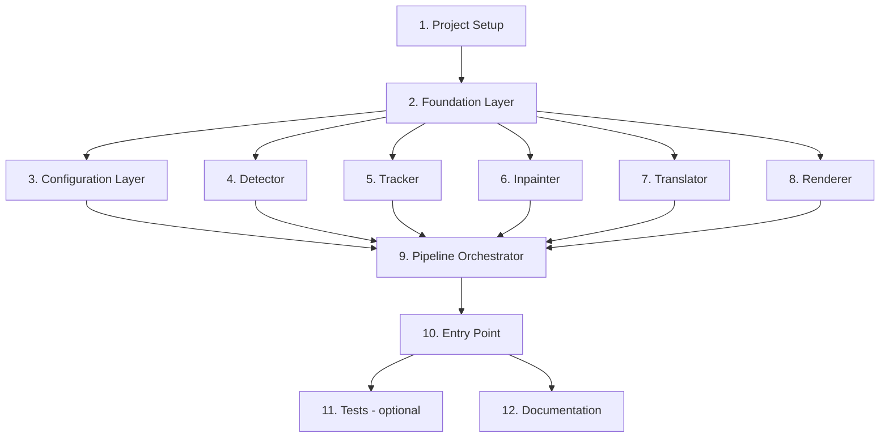

# Implementation Plan

## Overview

Kế hoạch triển khai MVP của Video Text Translator theo thứ tự bottom-up: foundation pure code → modules độc lập → orchestrator → entry point. Mỗi task nhỏ, có thể verify riêng, và liên kết rõ với requirements + design. Dành riêng các nhóm verify standalone (`scripts/verify_*.py`) để user (không quen Python) có thể chạy thử và xác nhận từng module hoạt động trước khi ghép vào pipeline.

## Task Dependency Graph



```json
{
  "waves": [
    {
      "id": "wave-1",
      "name": "Project Setup",
      "tasks": ["1.1", "1.2", "1.3", "1.4", "1.5"],
      "dependencies": []
    },
    {
      "id": "wave-2",
      "name": "Foundation Layer",
      "tasks": ["2.1", "2.2", "2.3", "2.4", "2.5", "2.6", "2.7"],
      "dependencies": ["wave-1"]
    },
    {
      "id": "wave-3",
      "name": "Configuration Layer",
      "tasks": ["3.1", "3.2", "3.3"],
      "dependencies": ["wave-2"]
    },
    {
      "id": "wave-4",
      "name": "Detector Module",
      "tasks": ["4.1", "4.2", "4.3", "4.4", "4.5"],
      "dependencies": ["wave-2"]
    },
    {
      "id": "wave-5",
      "name": "Tracker Module",
      "tasks": ["5.1", "5.2", "5.3", "5.4", "5.5", "5.6"],
      "dependencies": ["wave-2"]
    },
    {
      "id": "wave-6",
      "name": "Inpainter Module",
      "tasks": ["6.1", "6.2", "6.3", "6.4"],
      "dependencies": ["wave-2"]
    },
    {
      "id": "wave-7",
      "name": "Translator Module",
      "tasks": ["7.1", "7.2", "7.3", "7.4", "7.5"],
      "dependencies": ["wave-2"]
    },
    {
      "id": "wave-8",
      "name": "Renderer Module",
      "tasks": ["8.1", "8.2", "8.3", "8.4", "8.5"],
      "dependencies": ["wave-2"]
    },
    {
      "id": "wave-9",
      "name": "Pipeline Orchestrator",
      "tasks": ["9.1", "9.2", "9.3", "9.4", "9.5", "9.6", "9.7", "9.8", "9.9"],
      "dependencies": ["wave-3", "wave-4", "wave-5", "wave-6", "wave-7", "wave-8"]
    },
    {
      "id": "wave-10",
      "name": "Entry Point",
      "tasks": ["10.1", "10.2"],
      "dependencies": ["wave-9"]
    },
    {
      "id": "wave-11",
      "name": "Tests (optional)",
      "tasks": ["11.1", "11.2", "11.3", "11.4", "11.5", "11.6"],
      "dependencies": ["wave-10"]
    },
    {
      "id": "wave-12",
      "name": "Documentation",
      "tasks": ["12.1"],
      "dependencies": ["wave-10"]
    }
  ]
}
```

Foundation (wave-2) phải xong trước mọi module. Các module 4-8 độc lập với nhau, có thể làm song song. Pipeline (wave-9) gom tất cả lại. Entry point (wave-10) là bước cuối để chạy end-to-end.

## Tasks

### 1. Project Setup

- [ ] 1.1 Tạo cấu trúc thư mục dự án
  - Tạo các thư mục: `src/video_text_translator/`, `configs/`, `fonts/`, `tests/unit/`, `tests/property/`, `tests/integration/`, `tests/fixtures/`, `scripts/`
  - Tạo file `__init__.py` rỗng trong `src/video_text_translator/`
  - Tạo `.gitignore` (ignore `__pycache__/`, `*.pyc`, `.venv/`, `tmp/`)
  - _Requirements: tất cả_

- [ ] 1.2 Tạo `requirements.txt` với dependencies cố định version
  - Liệt kê: paddleocr, paddlepaddle (CPU default), opencv-python, deep-translator, Pillow, ffmpeg-python, numpy, tqdm, pyyaml, psutil
  - Liệt kê dev: pytest, hypothesis
  - Comment hướng dẫn user thay `paddlepaddle` bằng `paddlepaddle-gpu` nếu dùng GPU
  - _Files: `requirements.txt`_
  - _Requirements: 7.1, 7.7_

- [ ] 1.3 Cài đặt dependencies và verify môi trường
  - Tạo virtualenv `.venv` với Python 3.12: `python -m venv .venv`
  - Activate: `.venv\Scripts\activate`
  - Chạy `pip install -r requirements.txt`
  - Verify: `python -c "import paddleocr, cv2, PIL, deep_translator, ffmpeg, numpy, tqdm, yaml, psutil; print('OK')"`
  - Verify FFmpeg binary có sẵn: `ffmpeg -version`
  - _Requirements: 1.2, 7.7_

- [ ] 1.4 Bundle font tiếng Việt mặc định
  - Download Noto Sans Regular (.ttf) vào `fonts/NotoSans-Regular.ttf`
  - Download Be Vietnam Pro Regular (.ttf) vào `fonts/BeVietnamPro-Regular.ttf`
  - Verify load được bằng Pillow: `python -c "from PIL import ImageFont; ImageFont.truetype('fonts/NotoSans-Regular.ttf', 20)"`
  - _Files: `fonts/NotoSans-Regular.ttf`, `fonts/BeVietnamPro-Regular.ttf`_
  - _Requirements: 6.2_

- [ ] 1.5 Tạo `configs/default.yaml` với toàn bộ tham số default
  - Sao chép YAML schema từ design.md section "Configuration Schema"
  - Đảm bảo đủ tất cả tham số: compute_mode, detector, tracker, inpainter, translator, renderer, performance
  - _Files: `configs/default.yaml`_
  - _Requirements: 2.5, 3.5, 4.2-4.4, 5.2, 6.2, 7.1, 9.4, 10.1, 10.4_

### 2. Foundation Layer (Pure Code, No External Dependencies)

- [ ] 2.1 Implement `errors.py` — exception hierarchy
  - Tạo `PipelineError` base + 5 subclass: `InvalidConfigError`, `InvalidInputError`, `ComputeInitError`, `MemoryLimitExceeded`, `OutputWriteError`
  - _Files: `src/video_text_translator/errors.py`_
  - _Design: Error Handling Strategy_

- [ ] 2.2 Implement `models.py` — frozen dataclasses
  - `Bounding_Box`, `Text_Region`, `Frame_Region_Entry`, `Text_Segment`, `Translation_Result`, `Style_Preset`
  - Sub-config: `Detector_Config`, `Tracker_Config`, `Inpainter_Config`, `Translator_Config`, `Performance_Config`, `Config`
  - Validation trong `__post_init__` cho positive dimensions, range checks
  - Tất cả `@dataclass(frozen=True, slots=True)`
  - _Files: `src/video_text_translator/models.py`_
  - _Requirements: 1.4, 2.4, 3.3, 6.2_
  - _Design: Data Models_

- [ ] 2.3 Implement `geometry.py` — pure geometric functions
  - Functions: `iou(a, b)`, `center_distance(a, b)`, `scale_box(box, factor)`, `clip_box_to_frame(box, w, h)`, `frame_diagonal(w, h)`
  - No side effects, fully deterministic
  - _Files: `src/video_text_translator/geometry.py`_
  - _Design: Algorithms A1, A6, A7_

- [ ] 2.4 Implement `text_utils.py` — pure text functions
  - Functions: `content_similarity(a, b)`, `has_cjk(s)`, `normalize_text(s)`
  - Self-contained Levenshtein implementation (không dùng package ngoài)
  - _Files: `src/video_text_translator/text_utils.py`_
  - _Design: Algorithm A2_
  - _Requirements: 2.3, 3.1_

- [ ] 2.5 Implement `logging_config.py` — logging setup
  - Function `setup_logging(verbose: bool, quiet: bool)` cấu hình root logger với format chuẩn
  - Log có context: timestamp, level, module name, message
  - _Files: `src/video_text_translator/logging_config.py`_
  - _Requirements: 8.4_

- [ ] 2.6 Implement `progress.py` — tqdm wrapper
  - Class `ProgressReporter` với methods: `start(total, stage_name)`, `update(n=1)`, `set_stage(name)`, `close()`
  - Hiển thị: stage name + frames processed / total + percentage
  - _Files: `src/video_text_translator/progress.py`_
  - _Requirements: 8.3_

- [ ] 2.7 Verify foundation layer
  - Tạo file scratch chạy nhanh: import từng module, gọi vài function
  - Đảm bảo không có syntax error, không có circular import
  - _Verify: `python -c "from src.video_text_translator import models, geometry, text_utils, errors; print('OK')"`_

### 3. Configuration Layer

- [ ] 3.1 Implement `config.py` — YAML loader + validation
  - `load_yaml(path)`: đọc file YAML, raise `InvalidConfigError` nếu fail
  - `validate_config(d)`: kiểm tra range/enum theo Constraint Summary trong design.md
  - `Config.from_dict(d)`: build immutable `Config` instance
  - _Files: `src/video_text_translator/config.py`_
  - _Requirements: 4.6, 6.2, 7.1, 7.6, 8.2, 9.7, 10.1, 10.4, 10.7_

- [ ] 3.2 Implement CLI parser trong `config.py`
  - `build_argparser()` với toàn bộ CLI args theo design.md "CLI Interface"
  - `cli_overrides(ns)`: argparse Namespace → sparse dict
  - `deep_merge(base, override)`: merge nested dict
  - `load_config(cli_args)`: orchestrate load YAML → CLI override → validate → return Config
  - _Files: `src/video_text_translator/config.py`_
  - _Requirements: 8.1, 8.2_

- [ ] 3.3 Verify config layer
  - Test load `configs/default.yaml` thành công
  - Test validation reject giá trị sai (e.g. `compute_mode=foo`, `ocr_stride=99`)
  - Test CLI override (`--compute-mode gpu` override yaml)
  - _Verify: tự viết script `scripts/verify_config.py`_

### 4. Detector Module

- [ ] 4.1 Implement `IDetector` Protocol và `PaddleOCRDetector` skeleton
  - Protocol với `detect`, `detect_batch`, `warmup`
  - `__init__(compute_mode, confidence_threshold, downscale, lang)`
  - _Files: `src/video_text_translator/detector.py`_
  - _Design: Components/Detector_

- [ ] 4.2 Implement compute_mode init + GPU fallback
  - Thử PaddleOCR `use_gpu=True` nếu compute_mode="gpu"
  - Fail: log warn, fallback `use_gpu=False`
  - Fallback fail: raise `ComputeInitError`
  - _Files: `src/video_text_translator/detector.py`_
  - _Requirements: 7.2-7.5_

- [ ] 4.3 Implement `detect(frame)` với downscale + post-processing
  - Resize frame theo `OCR_Downscale` (bilinear) trước OCR
  - Filter result theo confidence threshold
  - Filter CJK (dùng `has_cjk`)
  - Scale bbox về tọa độ frame gốc
  - Wrap try/except: log lỗi + return [] nếu PaddleOCR ném exception
  - _Files: `src/video_text_translator/detector.py`_
  - _Requirements: 2.1-2.5, 2.7, 10.5, 10.6_

- [ ] 4.4 Implement `detect_batch(frames)` cho batch processing
  - Loop tuần tự gọi `detect()` cho mỗi frame (MVP)
  - Return list of list of Text_Region
  - _Files: `src/video_text_translator/detector.py`_
  - _Requirements: 9.4, 9.5_

- [ ] 4.5 Verify Detector standalone
  - Chuẩn bị 1 ảnh có chữ Trung
  - Script: load ảnh → `detect()` → in ra list bbox + text
  - Confirm có ít nhất 1 Text_Region phát hiện được
  - _Files: `scripts/verify_detector.py`_

### 5. Tracker Module

- [ ] 5.1 Implement `ITracker` Protocol và `IoUContentTracker` skeleton
  - Class với fields: `_active_segments`, `_closed_segments`, `_next_id`, config thresholds
  - Tính `n_inactive_effective = max(3, ceil(n_inactive * ocr_stride))` lúc init
  - _Files: `src/video_text_translator/tracker.py`_
  - _Requirements: 10.9_

- [ ] 5.2 Implement matching logic trong `update(frame_index, timestamp, regions)`
  - Pre-filter: bỏ region rỗng/whitespace
  - Build candidate matches dùng IoU + content similarity + center distance theo Algorithm A3
  - Greedy resolve conflicts
  - Region không match: tạo segment mới
  - _Files: `src/video_text_translator/tracker.py`_
  - _Requirements: 3.1, 3.2, 3.4, 3.8_

- [ ] 5.3 Implement segment lifecycle: close inactive + max_active enforcement
  - Close segment không match `n_inactive_effective` frame liên tiếp
  - Số active segments > max_active: đóng cũ nhất
  - Closed segment không nhận match mới
  - _Files: `src/video_text_translator/tracker.py`_
  - _Requirements: 3.5, 3.7, 3.9_

- [ ] 5.4 Implement `fill_missing()` cho frame interpolation
  - Với mỗi segment đã đóng, điền frame thiếu trong [start_frame, end_frame] dùng nearest-neighbour
  - Set `interpolated=True` cho entry điền vào
  - _Files: `src/video_text_translator/tracker.py`_
  - _Requirements: 10.3, 3.6_

- [ ] 5.5 Implement `finalize()` 
  - Đóng tất cả active segments còn lại
  - Gọi `fill_missing()` cho mỗi segment
  - Return tuple of all `Text_Segment`
  - _Files: `src/video_text_translator/tracker.py`_

- [ ] 5.6 Verify Tracker standalone
  - Script: feed regions tự tạo (cùng text, cùng vị trí qua nhiều frame) → confirm gộp 1 segment
  - Feed regions khác text → confirm tạo nhiều segments
  - Test fill_missing với stride 3 → entries phải liên tục
  - _Files: `scripts/verify_tracker.py`_

### 6. Inpainter Module

- [ ] 6.1 Implement `IInpainter` Protocol và `OpenCVInpainter`
  - `__init__(algorithm, radius, padding)` validate algorithm "telea"/"ns"
  - Map algorithm → cv2 flag
  - _Files: `src/video_text_translator/inpainter.py`_
  - _Requirements: 4.4-4.6_

- [ ] 6.2 Implement `make_mask(frame_shape, boxes)` — pure function
  - Tạo `np.zeros((H, W), uint8)` mask
  - Mỗi box: nới padding, clip vào frame, set vùng = 255
  - _Files: `src/video_text_translator/inpainter.py`_
  - _Requirements: 4.1, 4.3, 4.8_
  - _Design: Algorithm A6_

- [ ] 6.3 Implement `inpaint_frame(frame, boxes)`
  - Build mask + gọi `cv2.inpaint(frame, mask, radius, flag)`
  - _Files: `src/video_text_translator/inpainter.py`_
  - _Requirements: 4.2, 4.7_

- [ ] 6.4 Verify Inpainter standalone
  - Script: load ảnh có text, tạo bbox, gọi inpaint, save kết quả
  - Mở ảnh check mắt: text đã bị xóa
  - _Files: `scripts/verify_inpainter.py`_

### 7. Translator Module

- [ ] 7.1 Implement `ITranslator` Protocol và `GoogleTranslator` với cache
  - Class với field `_cache: dict[str, Translation_Result]`
  - `__init__(timeout_seconds, max_chars, max_retries, backoff_seconds)`
  - _Files: `src/video_text_translator/translator.py`_

- [ ] 7.2 Implement `translate(text)` với passthrough/oversize/cache
  - Empty/whitespace → status="passthrough"
  - len(stripped) > max_chars → status="untranslated", warn log
  - Cache hit → return cached
  - _Files: `src/video_text_translator/translator.py`_
  - _Requirements: 5.3, 5.6, 5.7_

- [ ] 7.3 Implement retry/backoff cho backend call
  - Try gọi `deep_translator.GoogleTranslator(source='zh-CN', target='vi').translate(text)`
  - Retry up to max_retries với backoff (1s, 2s, 4s)
  - Sau cùng vẫn fail: status="untranslated", trả text gốc
  - Success: cache + return
  - _Files: `src/video_text_translator/translator.py`_
  - _Requirements: 5.1, 5.2, 5.4, 5.5_

- [ ] 7.4 Implement `translate_segments(segments)` — batch dịch
  - Loop call `translate()` cho mỗi segment
  - Return `dict[segment_id, Translation_Result]`
  - _Files: `src/video_text_translator/translator.py`_

- [ ] 7.5 Verify Translator standalone (cần internet)
  - Script: dịch một vài chuỗi tiếng Trung mẫu → in kết quả tiếng Việt
  - Test cache: dịch 2 lần cùng chuỗi → lần 2 không gọi backend
  - _Files: `scripts/verify_translator.py`_

### 8. Renderer Module

- [ ] 8.1 Implement `IRenderer` Protocol và `PillowRenderer` skeleton
  - `__init__(default_font_path)` — load font check tồn tại
  - _Files: `src/video_text_translator/renderer.py`_

- [ ] 8.2 Implement `auto_fit_font_size(text, box, style)` — binary search
  - Theo Algorithm A5: binary search trong [min, max], return None nếu min vẫn overflow
  - Tính text bbox bao gồm stroke + shadow offset
  - _Files: `src/video_text_translator/renderer.py`_
  - _Requirements: 6.3, 6.4, 6.7_

- [ ] 8.3 Implement `place_text(text_size, box)` — center placement với tolerance
  - Theo Algorithm A7: center trong box, clip biên, kiểm tolerance ≤ 2 pixel
  - Return None nếu vượt tolerance
  - _Files: `src/video_text_translator/renderer.py`_
  - _Requirements: 6.5, 6.6_

- [ ] 8.4 Implement `render(frame, text_vi, box, style)` — vẽ text lên frame
  - Convert frame numpy → PIL Image (BGR → RGB)
  - Vẽ background (RGBA với alpha)
  - Vẽ shadow (text với offset)
  - Vẽ stroke + main text bằng `ImageDraw.text` với `stroke_width`, `stroke_fill`
  - Convert PIL → numpy (RGB → BGR)
  - Skip + log warn khi auto_fit/place_text trả None
  - _Files: `src/video_text_translator/renderer.py`_
  - _Requirements: 6.1, 6.2, 6.8, 6.9_

- [ ] 8.5 Verify Renderer standalone
  - Script: load 1 frame trắng 1080p, render text "Xin chào" với style đầy đủ, save kết quả
  - Mở ảnh kiểm tra: text Việt hiện đúng, có viền + shadow + background
  - _Files: `scripts/verify_renderer.py`_

### 9. Pipeline Orchestrator

- [ ] 9.1 Implement `Pipeline` class skeleton + dependency injection
  - Constructor nhận `Config` + 5 module instances (qua Protocol)
  - Stub method `run(input_path, output_path) -> int`
  - _Files: `src/video_text_translator/pipeline.py`_

- [ ] 9.2 Implement `validate_inputs()` — pre-flight checks
  - Path checks: input tồn tại + đọc được; output dir tồn tại + ghi được
  - File size + duration check (≤ 5GB, ≤ 7200s)
  - Open `cv2.VideoCapture` thử mở để check format
  - Raise `InvalidInputError` với thông báo cụ thể
  - _Files: `src/video_text_translator/pipeline.py`_
  - _Requirements: 1.5, 1.6, 1.7, 1.9_

- [ ] 9.3 Implement video metadata probe
  - Lấy width, height, fps, total_frames, has_audio (qua ffmpeg.probe)
  - _Files: `src/video_text_translator/pipeline.py`_
  - _Requirements: 1.4_

- [ ] 9.4 Implement Pass 1 — streaming detect + track
  - Mở `cv2.VideoCapture`, loop đọc frame
  - Chỉ gọi `detector.detect()` khi `frame_idx % ocr_stride == 0` hoặc frame cuối
  - Gọi `tracker.update(frame_idx, timestamp, regions)`
  - Cập nhật progress bar (stage="detection+tracking")
  - Memory check mỗi N frame (psutil)
  - _Files: `src/video_text_translator/pipeline.py`_
  - _Requirements: 8.3, 9.6, 10.2_

- [ ] 9.5 Implement segment finalization + translation
  - `tracker.finalize()` → tất cả segments
  - `translator.translate_segments(segments)` → translation map
  - Log stats: tổng segments, success, fail
  - _Files: `src/video_text_translator/pipeline.py`_
  - _Requirements: 5.1, 8.4_

- [ ] 9.6 Implement Pass 2 — streaming inpaint + render + write
  - Reset `cv2.VideoCapture`
  - Mở `cv2.VideoWriter` ghi vào file tmp `<output>.tmp.mp4` codec mp4v
  - Loop đọc frame, lookup segments active tại frame
  - Gọi `inpainter.inpaint_frame(frame, boxes)` rồi `renderer.render(...)` cho mỗi segment
  - Write frame
  - _Files: `src/video_text_translator/pipeline.py`_
  - _Requirements: 4.7, 6.1, 6.8, 8.3_

- [ ] 9.7 Implement audio mux qua ffmpeg
  - Có audio: ffmpeg copy audio từ input + video từ tmp → output, cả hai `-c copy`
  - Không audio: copy tmp → output
  - Xóa tmp sau khi mux xong
  - _Files: `src/video_text_translator/pipeline.py`_
  - _Requirements: 1.2, 1.3_

- [ ] 9.8 Implement no-text shortcut
  - Pass 1 không có segment: log warn, copy input → output
  - _Files: `src/video_text_translator/pipeline.py`_
  - _Requirements: 2.6_

- [ ] 9.9 Implement final verification + exit codes
  - Sau Pass 2: check output file tồn tại + size > 0
  - In stdout đường dẫn output tuyệt đối
  - Catch toàn bộ exception ở `run()` outer level: log stack trace, return non-zero code
  - _Files: `src/video_text_translator/pipeline.py`_
  - _Requirements: 8.5, 8.6, 8.7_

### 10. Entry Point

- [ ] 10.1 Implement `main.py` — CLI wiring
  - Build argparser từ `config.build_argparser()`
  - Parse args, load config (with overrides)
  - Setup logging
  - Wire concrete modules: `PaddleOCRDetector`, `IoUContentTracker`, `OpenCVInpainter`, `GoogleTranslator`, `PillowRenderer`
  - Tạo `Pipeline(config, *modules)` rồi `run()`
  - `sys.exit` với mã trả về
  - _Files: `main.py`_
  - _Requirements: 8.1, 8.5, 8.7_

- [ ] 10.2 Smoke test end-to-end với video thật
  - Chuẩn bị 1 video ngắn (~10-30s) tiếng Trung user cung cấp
  - Chạy: `python main.py -i sample.mp4 -o out.mp4`
  - Verify: file `out.mp4` tồn tại, mở xem được, text Việt thay vào vị trí text Trung
  - Test thêm với `--compute-mode cpu` và `--compute-mode gpu` (nếu có GPU)

### 11. Tests (Optional cho MVP, recommended)

- [ ] 11.1 Setup pytest + hypothesis configuration
  - Tạo `pytest.ini` test config
  - Tạo `tests/conftest.py` common fixtures
  - _Files: `pytest.ini`, `tests/conftest.py`_

- [ ] 11.2 Property tests cho geometry và text_utils (8 properties)
  - Properties 1, 2, 3, 4, 6, 13, 24, 25 (xem design.md)
  - _Files: `tests/property/test_property_*.py`_

- [ ] 11.3 Property tests cho tracker (8 properties)
  - Properties 5, 7, 8, 9, 10, 11, 12, 26
  - _Files: `tests/property/test_property_*.py`_

- [ ] 11.4 Property tests cho translator + renderer (5 properties)
  - Properties 15-20
  - _Files: `tests/property/test_property_*.py`_

- [ ] 11.5 Property tests cho config + pipeline (5 properties)
  - Properties 14, 21, 22, 23
  - _Files: `tests/property/test_property_*.py`_

- [ ] 11.6 Unit tests cho từng module với mock
  - test_detector.py, test_tracker.py, test_inpainter.py, test_translator.py, test_renderer.py, test_pipeline.py, test_config.py
  - Mock external dependencies: PaddleOCR, deep_translator backend, cv2.inpaint
  - _Files: `tests/unit/test_*.py`_

### 12. Documentation

- [ ] 12.1 Tạo `README.md` với quickstart guide
  - Section: Giới thiệu (1 đoạn ngắn về tool)
  - Section: Yêu cầu hệ thống (Windows, Python 3.12, FFmpeg, optional GPU)
  - Section: Cài đặt — bước cụ thể từ git clone → venv → install → font → verify
  - Section: Cách dùng cơ bản (CLI examples)
  - Section: CPU vs GPU mode (cách switch + cách install paddlepaddle-gpu)
  - Section: Cấu hình advanced (link đến `configs/default.yaml`)
  - Section: Troubleshooting (lỗi thường gặp: paddleocr download model, ffmpeg not found)
  - _Files: `README.md`_

## Notes

- **Verify từng bước**: Mỗi nhóm module có task `verify_*.py` riêng để chạy thử trước khi ghép vào pipeline. User không quen Python có thể chạy script này để xác nhận từng phần hoạt động.
- **MVP first**: Bỏ qua optimization phức tạp (PaddleOCR batch API native, ProPainter, NLLB-200) cho MVP. Sau khi MVP chạy được mới optimize.
- **CPU-only path**: Mọi task đều phải chạy được trên máy chỉ có CPU (Intel Ultra 5 134U). GPU mode là optional bonus.
- **Test optional cho MVP**: Section 11 có thể skip để có MVP nhanh, nhưng property tests rất hữu ích cho long-term maintenance.
- **Independence rule**: Modules 4-8 không import lẫn nhau, chỉ import models + pure helpers. Pipeline (9) là nơi duy nhất ghép chúng lại.
